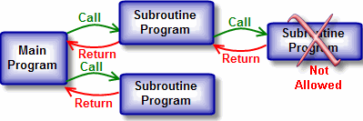
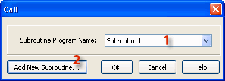
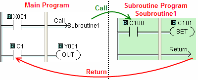

## Definition

The Call instruction is required to call a SubroutineProgram from the Main Program. The Call instruction resides in the Coil Area of the Main Program. A Subroutine program must have a [Return](return.md) instruction to return to the Main Program.

- Note: You can have up to 986 Subroutine Programs in a CLICK project.

The nesting level of the Subroutine is 1. This means a Subroutine Program cannot Call another Subroutine Program. It always needs to return to the Main Program.

## Setup

Position the Box Cursor on the Coil Area of the rung you have selected. This will be the enabling rung for the Call instruction. Select Call from the [Instruction Menu > Program Control](popup_instr_prog_call.md) or the Instruction List. The Call instruction is only visible on the Instruction List when viewing the Main Program.

1Subroutine Program Name: Select the desired Subroutine program from the drop-down list, and click OK.

2 Add New Subroutine: If you have not already created a Subroutine program, you can do so by clicking the Add New Subroutine button. The [Add New Subroutine](070.md) dialog will appear, and you can create a Subroutine Program.

## Example Program

Example Program: Call and Return

In this Example Program, when X001 is ON, the Call instruction causes the Subroutine Program to be processed immediately. The Subroutine Program must contain at least a Return instruction. Once a Return instruction is executed, the CLICK CPU continues executing the Main Program after the Call instruction.

### Related Topics:

[Add New Subroutine](070.md) 
[Quick Guide Subroutine](112.md) 
[Return](return.md)
