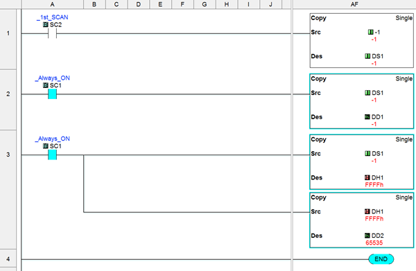
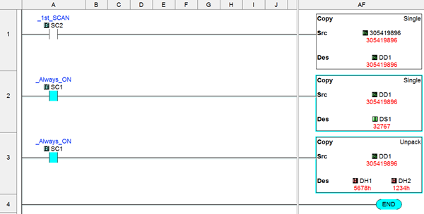
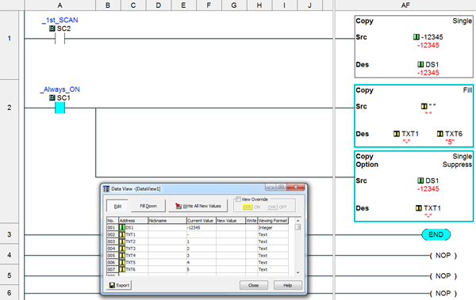
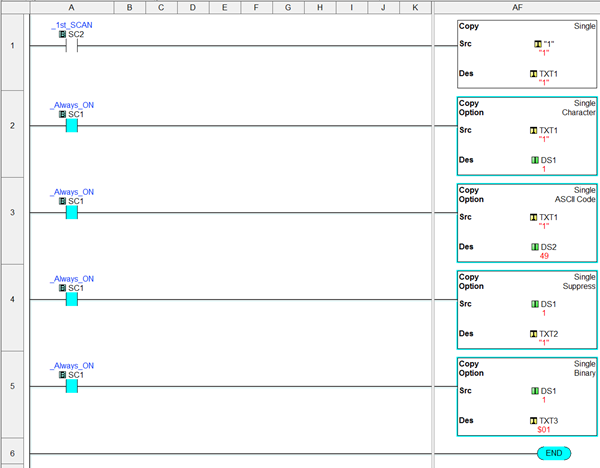

All CLICK registers are stored as Signed values except for DH. For Single Word Integers this allows a range of -32,768 to 32,767. For Double Word Integers the range is -2,147,483,648 to 2,147,483,647. Negative values are stored as Two’s-Complement. A value of -1 is stored in a DS register as 0xFFFF. The same -1 value stored in a DD registers is 0xFFFFFFFF.

## Example 1: Bypassing the Sign Priority

The Copy Instruction preserves the sign when moving data between different datatype sizes. The following example shows how to bypass this sign priority. This is useful when a signed register actually contains an unsigned value.

**Rung1**: Initialize DS1 to a value of -1.

**Rung2**: Move the signed DS1 register to the signed DD1 register. The sign is preserved and the decimal value of the 32-bit register DD1 is the same as the 16-bit register DS1. The result is -1 (0xFFFFFFFF).

**Rung3**: Move the signed DS1 register (which contains an unsigned value) to the signed DD1 register. First, Copy from DS to DH, the binary pattern is copied. Second, Copy from DH to DD, the binary pattern is copied. The result is 65535 (0x0000FFFF). This method works because the DH registers are unsigned.

## Example 2: Preserving values when moving between 32-bit and 16 bit registers

When moving values from a 32-bit to a 16-bit register care must be taken to avoid going Out of Range of the Destination datatype. The Copy instruction will range limit the value to the datatype of the Destination. Trying to copy a value of 1,000,000 into a DS will result in 32,767. If the binary data pattern needs to be preserved the 32-bit register can be Unpacked into two 16-bit registers.

**Rung1**: Initialize DD to a value of 305,419,896 (0x12345678).

**Rung2**: Move the signed DD1 register to the signed DS1 register. The Source value is too large for the Destination register and becomes limited to the maximum range 32,767 (0x7FFF).

**Rung3**: Unpack signed DD1 register to DH registers. The low word (0x5678) is copied into DH1, the high word (0x1234) is copied into DH2.

Example 3: Converting a Value to Text

Number Values can be converted into Strings using the Copy instruction. The Source will be a numeric register; the destination is a Text register. It may be useful to clear the destination registers (Fill with space characters “ “) before performing the conversion. The maximum output length depends on the Source datatype;

DH, 4 Characters DS, 6 Characters DD, 11 Characters DF, 14 Characters

**Rung1**: Initialize DS1 to a value of -12345.

**Rung2**: Clear the Destination TXT area. Copy the value from DS1 and convert to ASCII character string. As few as 1, and as many as 6 Destination registers will be updated depending on the number of digits in the Source (including minus sign for negative values).

Example 4: Converting Text to Numbers

Converting a numeric register to Text is fairly straightforward. But converting from Text to a numeric register can cause some confusion. The following example explores the various methods.

**Rung1**: Initialize TXT to the character “1”.

**Rung2**: Copy from a TXT to DS “Copy Character Value”. When the Source characters are numeric (0-9) then they will be translated into the proper numeric value to the Destination.

**Rung3**: Copy from a TXT to DS “Copy ASCII Code Value”. Copy the ASCII Code of the Source Character into the Destination.

**Rung4**: Copy from a DS to TXT “Copy Value”. Copy the value of the Source into as many Destination addresses as needed for the Source datatype.

**Rung5**: Copy from a DS to TXT “Copy Binary”. Copy the binary pattern of the Source into the Destination.

Example 5: More examples of casting strings into numeric registers.

**TXT to DF:** 

TXT1-TXT6 = “-12.34”, DF=-12.34

TXT1-TXT6 = “+12.34”, DF=12.34

TXT1-TXT6 = “ 12.34”, SC43 Out of Range = True, Leading Space not allowed.

TXT1-TXT6 = “12.34 ”, SC43 Out of Range = True, Trailing Space not allowed.

TXT1-TXT6 = “12,345”, SC43 Out of Range = True, Thousands separator not allowed.

TXT1-TXT6 = “-01234”, DF=-1234

TXT1-TXT6 = “1234e2”, DF=123400

TXT1-TXT6 = “1234E2”, DF=123400

TXT1-TXT6 = “123e-2”, DF=1.23

TXT1-TXT10 = “-01234e-02”, DF=-12.34

 

**TXT to DS, DD, TD, or CTD:**

TXT1-TXT6 = “123456”, DD=123456

TXT1-TXT6 = “-12345”, DD=-12345

TXT1-TXT6 = “+12345”, DD=12345

TXT1-TXT6 = “000123”, DD=123

TXT1-TXT6 = “ 12345”, SC43 Out of Range = True, Leading Space not allowed.

TXT1-TXT6 = “12345 ”, SC43 Out of Range = True, Trailing Space not allowed.

TXT1-TXT6 = “12,345”, SC43 Out of Range = True, Comma separator not allowed.

TXT1-TXT6 = “12.345”, SC43 Out of Range = True, Period separator not allowed.

TXT1-TXT6 = “1234e2”, SC43 Out of Range = True, Exponential notation not allowed.

 

**TXT to DH:**

TXT1-TXT4 = “1234”, DH=0x1234

TXT1-TXT4 = “abcd”, DH=0xABCD

TXT1-TXT4 = “ABCD”, DH=0xABCD

TXT1-TXT4 = “ ABC”, SC43 Out of Range = True, Leading Space not allowed.

TXT1-TXT4 = “ABC ”, SC43 Out of Range = True, Trailing Space not allowed.

TXT1-TXT6 = “A,BC”, SC43 Out of Range = True, Comma separator not allowed.

TXT1-TXT6 = “A.BC”, SC43 Out of Range = True, Period separator not allowed.

 

### Related Topics:

[Single Copy](copy_single.md) 
[Block Copy](copy_block.md) 
[Pack Copy](copy_pack.md) 
[Unpack Copy](copy_unpack.md)

 
