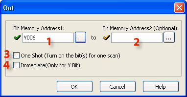
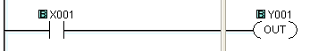
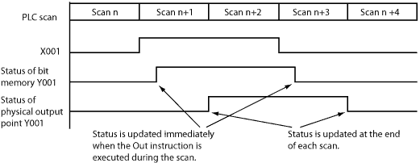
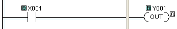
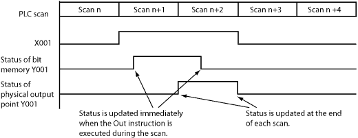
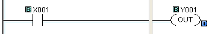
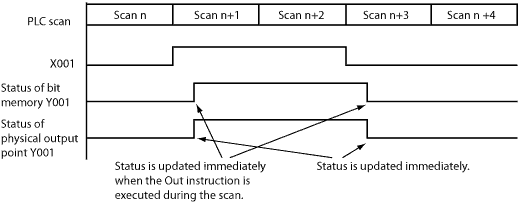

## Definition

An Out instruction turns ON its associated Bit Memory when the status of the rung is true. The Out instruction turns OFF its associated Bit Memory when the status of the rung is false. An Out instruction is capable of turning ON and OFF more than one Bit Memory Address at the same time.

## Setup

1 Bit Memory Address 1: Choose a Bit Memory Address to associate with the Out instruction. Either type the Bit Memory Address directly in the address field or use the Browse Button to open the [Address Picker](148.md).

2 Bit Memory Address 2: The Out instruction permits a consecutive range of bit memory addresses to change state simultaneously. Choose a Bit Memory Address 2 to identify the end of the range of Bit Memory Addresses or leave this field blank if you only want one output to respond to this instruction.

- Note: Use this feature with care since it is permitted to reuse Bit Memory Addresses within the range specified.

3 One Shot: Choose One Shot to cause the Bit Memory Address to turn ON for one scan only or leave unchecked to allow the Bit Memory Address to be processed during each scan. If selected, the [One Shot Icon](popup_one_shot_out_symbol.md) will appear adjacent to the Coil in the Ladder Editor.

4 Immediate: Choose Immediate if you want this bit processed asynchronously in relation to the scan. This feature is only available for actual Y outputs. This option is grayed out until a Y address is chosen. The [Immediate Icon](popup_immediate_out_rung_icon.md) will appear adjacent to the Coil in the Ladder Editor.

## Example Programs

Example Program 1: Default (No option)

In the following example, when input status bit X001 is ON, the Out instruction turns ON output status bit Y001 immediately. However, the CLICK PLC updates the physical output point (Y001 is the 1st output point on the CPU module) at the end of each scan. Please refer to the timing diagram to see the difference.

Timing Diagram

Example Program 2: One Shot

In the following example, when input status bit X001 is ON, the Out instruction turns ON output status bit Y001 for one scan. Please refer to the timing diagram to see the difference.

Timing Diagram

Example Program 3: Immediate (Available only for the Y memory type)

In the following example, when input status bit X001 is ON, the Out instruction turns ON both the output status bit Y001 and the physical output point (**Y001** is the 1st output point on the **CPU** module) immediately. Please refer to the timing diagram to see the difference.

Timing Diagram

