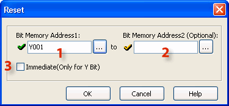
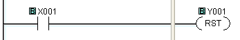
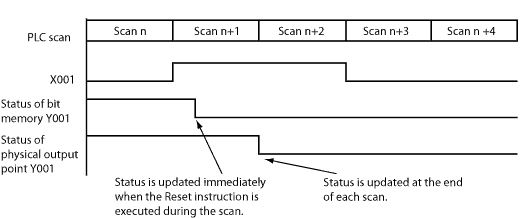
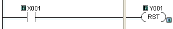
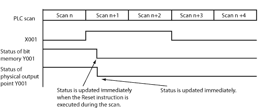

## Definition

The Reset instruction shall turn off the associated bit memory when the status of the rung is true. The Bit Memory stays OFF after the rung becomes False. A Reset instruction shall turn off more than one bit memory at the same time.

## Setup

1 Bit Memory Address 1: Choose a Bit Memory Address to associate with the Reset instruction. Either type the Bit Memory Address directly in the address field or use the Browse Button  to open the [Address Picker](148.md).

2 Bit Memory Address 2: The Reset instruction permits a consecutive range of bit memory addresses to be Reset simultaneously. Choose a Bit Memory Address 2 to identify the end of the range of Bit Memory Addresses or leave this field blank if you only want just one output to respond to this instruction.

3 Immediate (Only for Y Bit): Choose the Immediate Icon if you want to turn OFF the Output(s) immediately. This feature is only available for actual Y outputs. This option is grayed out until a Y address is chosen. The [Immediate Icon](popup_immediate_out_rung_icon.md) will appear adjacent to the Reset Coil in the Ladder Editor.

- Note: Each Set Coil in your Ladder Program should be accompanied by a Reset Coil to turn OFF the addresses that were turned ON by the Set Coil.

## Example Program

Example Program 1: Default (No option)

In the following example, when input status bit X001 is ON, the Reset instruction turns OFF the output status bit Y001 immediately. Y001 stays OFF even if X001 is turned OFF.

Timing Diagram

Example Program 2: Immediate (Available only for the Y memory type)

In the following example, when input status bit X001 is ON, the Reset instruction turns OFF both the output status bit Y001 and the physical output point (Y001 is the 1st output point on the **CPU** module) immediately. Please refer to the timing diagram to see the difference.

Timing Diagram

### Related Topics:

[Set Coil](coil_set.md)
