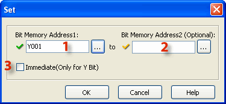
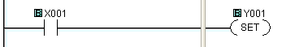
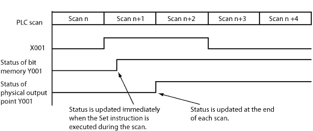
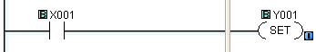
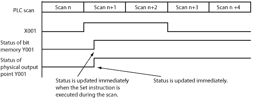

## Definition

The Set instruction turns ON the associated Bit Memory when the status of the rung is True. The Bit Memory stays on after the rung becomes False. The Set instruction can turn ON more than one Bit Memory at the same time.

## Setup

1 Bit Memory Address1: Choose a Bit Memory Address to associate with the Set instruction. Either type the Bit Memory Address directly in the address field or use the Browse Button   to open the [Address Picker](148.md).

2 Bit Memory Address2 (Optional): The Set instruction permits a consecutive range of bit memory addresses to be Set simultaneously. Choose a Bit Memory Address to identify the end of the range of Bit Memory Addresses or leave this field blank if you only want just one Bit Memory Address to respond to this instruction.

3 Immediate (Only for Y Bit): Choose Immediate if you want to turn on the Output(s) immediately. This feature is only available for actual Y outputs. This option is grayed out until a Y address is chosen. The [Immediate Icon](popup_immediate_out_rung_icon.md) will appear adjacent to the Set Coil in the Ladder Editor.

- Note: Each Set Coil in your Ladder Program should be accompanied by a Reset Coil to turn OFF the addresses that were turned ON by the Set Coil.

## Example Programs

Example Program 1: Default

In the following example, when input status bit X001 is ON, the Set instruction turns ON the output status bit Y001 immediately. After that, Y001 stays ON even if X001 is turned OFF.

Timing Diagram

Example Program 2: Immediate (Available only for the Y memory type)

In the following example, when input status bit X001 is ON, the Set instruction turns ON both the output status bit Y001 and the physical output point (Y001 is the 1st output point on the **CPU** module) immediately. Please refer to the timing diagram to see the difference.

Timing Diagram

### Related Topics:

[Reset Coil](coil_reset.md) 
[Memory Addresses](memory_addresses.md)
