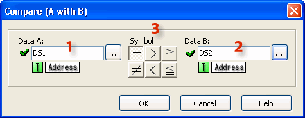
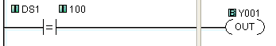
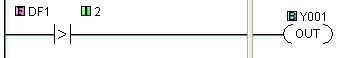
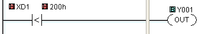
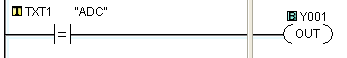

## Definition

The Compare A with B instruction uses a Mathematical Operator as a basis of comparison of two data values. A mathematical statement is developed using the instruction dialog. When the [Data A](data_compatibility.md) and [Data B](data_compatibility.md) values satisfy the selected mathematical relationship, the Compare Contact turns ON.

## Setup

The fields Data A and Data B can contain memory addresses or Constants. Constants are created by typing the value directly into the Data A or Data B fields. Use the typing guidelines for the [Data Type](data_types.md) you are selecting. See the available Data combination to determine if two data types can be compared.

1 [Data A](data_compatibility.md): Select the first Data Memory Address or the Constant to be compared. The Data Memory Address or the Constant can be typed directly into the Address field on the dialog or the Data Memory Address can be selected from the Address Picker.

Click on the Browse Button to open the [Address Picker](148.md).

2[Data B](data_compatibility.md): Select the second Data Memory Address or the Constant to be compared.

3 Symbol: Select the Mathematical Operator that defines the intended relationship between Data A and Data B.

## Example Programs

Example Program 1: Compare Integer Data

In the following example, when DS1 is 100, Y001 will energize.

Example Program 2: Compare floating point data

In the following example, when DF1 is more than 2, Y001 will energize. As you can see, you can compare floating point data with integer or floating point data.

Example Program 3: Compare Hex data

In the following example, when XD1 is less than 200h, Y001 will energize.

Example Program 4: Compare Text data

In the following example, when TXT1 to TXT3 are ”ADC” (TXT1 = ”A”, TXT2 = ”D”, TXT3 = ”C”), Y001 will energize.

### Related Topics:

[Data Types](data_types.md) 
[Data Compatibility Table](data_compatibility.md) 
[Memory Addresses](memory_addresses.md)
