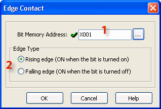
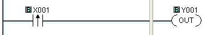
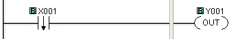

Shortcuts: Rising Edge = SHIFT + F2 / Falling Edge = SHIFT + F3

## Definition

The Edge Contact turns ON when the related bit transitions from OFF to ON ( Rising Edge ) or ON to OFF ( Falling Edge ).

## Setup

1 Bit Memory Address: The Edge Contact requires a [Bit Memory Address](popup_bit_memory_addr.md). The Bit Memory Address can be typed directly into the Address field on the dialog or it can be selected from the Address Picker.

Click on the Browse Button to open the [Address Picker](148.md).

2 Edge Type: Select Rising Edge or Falling Edge contact using the radio buttons on the dialog.

## Example Programs

Example Program 1

In the following example, each time X001 makes an OFF-to-ON transition, Y001 will energize for one scan.

Sample Program 2

In the following example, each time X001 makes an ON-to-OFF transition, Y001 will energize for one scan.

### Related Topics:

[Instruction List](135.md) 
[Checkmarks](popup_checkmarks.md) 
[Memory Addresses](memory_addresses.md)
