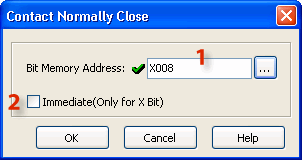

## Definition

The Normally Closed Contact mimics the behavior of a physical contact and changes in response to the status of a [Bit Memory Address](popup_bit_memory_addr.md). The Normally Closed Contact is ON when the related bit is OFF.

## Setup

1 Bit Memory Address: The Normally Closed Contact requires a [Bit Memory Address](popup_bit_memory_addr.md). The Bit Memory Address can be typed directly into the Address field on the dialog or it can be selected from the Address Picker.

Click on the Browse Button to open the [Address Picker](148.md).

2 Immediate (Only for X Bit): Use this checkbox ONLY for X Bit Addresses. The status of all X Addresses are updated by reading the status of physical input points in the beginning of each program scan. If the program scan time is getting long, you may want to read the current status of a physical input point when the instruction is executed. In this case, use the Immediatecheckbox to declare the X Input to be a Normally Closed ImmediateContact. This option is grayed out until an X address is chosen.

## Example Program

Example Program

In the following example, when X001 is OFF, Y001 will be ON.

### Related Topics:

[Instruction List](135.md) 
[Checkmarks](popup_checkmarks.md)
