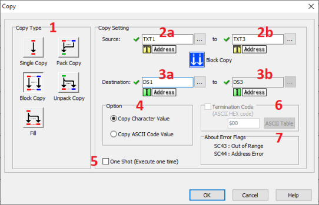
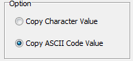
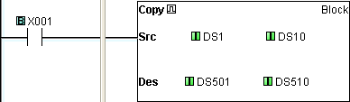

## Block Copy Definition

The BlockCopy instruction is used to copy data or text from its Source registers to specified sequential Destination registers. The Source location of the data or text is identified by its beginning and ending MemoryAddresses, and the Destination registers are identified by the Memory Address of the first register in the sequence.

- Destination
- Bits Registers
- Y C DS DD DH DF YD TD CTD SD TXT
- Source Bits X, Y, T, CT, SC ● ●
- C ● ●
- Registers DS ● ● ● ● ● ● ●
- DD ● ● ● ● ● ● ●
- DH ● ● ● ● ● ● ●
- DF ● ● ● ● ● ● ●
- XD, YD, TD, CTD
- SD ● ● ● ● ● ● ●
- TXT ● ● ● ●
- Constant Decimal, Hex
- String, ASCII Code

## Setup

1 Copy Type: Select Block Copy to copy multiple registers from their Source locations to Destination locations.

2a Source: Identify the beginning Source Memory Address.

2b Source: Identify the ending Source Memory Address. The ending Source Memory Address must be the same type as the beginning Source Memory Address.

3a Destination: Identify the beginning Destination Memory Address. The Destination address must accommodate the Data Type of the Source entry.

3b Destination: The identity of the ending Destination Memory Address will be calculated by the CLICK programming software and will be visible in this box.

4 One: This **Option** field is used with certain combinations of **Source** and **Destination Data Types**. There is only a single Option available in **Block Copy** mode.

When the Source is Text and the Destination is Numeric:

 

**Source**: TXT1-TXT3 (The values are ‘1’, ‘2’, ‘3’) 
**Destination**: DS1-DS3 
The option ‘**Copy Character Value**’ is selected: DS1=1, DS2=2, DS3=3 
The option ‘**Copy ASCII Code Value**’ is selected: DS1=49 (31h), DS2=50 (32h), DS3=51 (33h)

5 One Shot: Choose One Shot to execute the Block Copy instruction one time when the enabling rung makes an OFF-to-ON transition. If One Shot is selected, the One Shot symbol will appear adjacent to the Coil in the Ladder Editor.

6 Termination Code: This option is supported by **C0-1x** and **C2-x** CPUs. When the Destination is Text Registers the Termination Code option becomes available. A single termination character can be added to the length of the Destination. Click on the checkbox to select and enter the ASCII Code in the field. Click on the ASCII Table button to open the ASCII Table shown below. Use this table to quickly select the desired ASCII Code.

7About Error Flag: SC43 and SC44 are Error Flags are available for use in your program. **SC43 Out of Range** is valid for Single, Block, and Pack Copy modes. **SC44 Address Error** is not used in Block Copy mode. 

## Example Program

Example Program: Block Copy Data Registers

In the following example, when X001 transitions from OFF-to-ON (One Shot is selected), the values in Memory Addresses DS1 through DS10 are copied to Memory Addresses DS501 through DS510.

### Related Topics:

[Single Copy](copy_single.md) 
[Fill](copy_fill.md) 
[Pack Copy](copy_pack.md) 
[Unpack Copy](copy_unpack.md)
