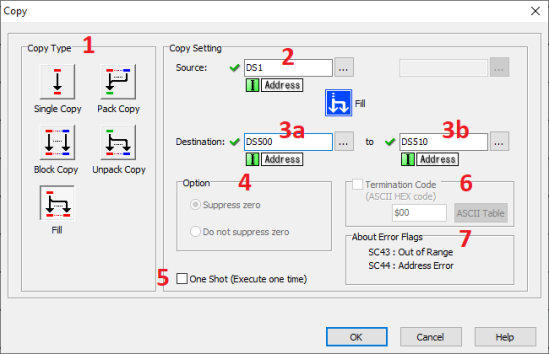
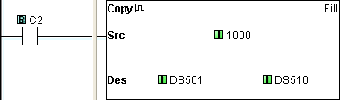

## Fill Definition

The Fill mode of the Copy Instruction is used to copy a data or text value from its Source location to a specified range of Destination registers. The Source location of the data or text can be another register, identified by its Memory Address, or it can be a constant value typed directly into the Source field on the dialog. Constant data or text values must follow the typing conventions for that [Data Type](data_types.md).

- Destination
- Bits Registers
- Y C DS DD DH DF YD TD CTD SD TXT
- Source Bits X, Y, T, CT, SC
- C
- Registers DS ● ● ● ● ● ● ● ●
- DD ● ● ● ● ● ● ● ●
- DH ● ● ● ● ● ● ● ●
- DF ● ● ● ● ● ● ● ●
- XD, YD, TD, CTD ● ● ● ● ● ● ● ●
- SD ● ● ● ● ● ● ● ●
- TXT ●
- Constant Decimal, Hex ● ● ● ● ● ● ● ● ●
- String, ASCII Code ●

## Setup

1 Copy Type: Select Fill to copy from a single data or text source to multiple Memory Addresses.

2 Source: Identify the Source Memory Address or type a constant data or text value in the Source field.

3a Destination: Identify the beginning Destination Memory Address. The Destination address must accommodate the Data Type of the Source entry.

3b Destination: Identify the ending Destination Memory Address.

4 Option: This **Option** field is not used in **Fill** mode.

5 One Shot: Choose One Shot to execute the Fill instruction one time when the enabling rung makes an OFF-to-ON transition. If One Shot is selected, the One Shot symbol will appear adjacent to the Coil in the Ladder Editor.

6 Termination Code: This option is supported by **C0-1x** and **C2-x** CPUs. When the Destination is Text Registers the Termination Code option becomes available. A single termination character can be added to the length of the Destination. Click on the checkbox to select and enter the ASCII Code in the field. Click on the ASCII Table button to open the ASCII Table shown below. Use this table to quickly select the desired ASCII Code.

7 About Error Flag:**SC43** and **SC44** are **Error Flags** available for use in your program. They are not used in **Fill** mode.

## Example Program

Example Program: Fill Destination with Data Constant

In the following example, when C2 transitions from OFF-to-ON (One Shot is selected), the Source constant 1000 is loaded in Memory Addresses DS501 through DS510.

### Related Topics:

[Single Copy](copy_single.md) 
[Block Copy](copy_block.md) 
[Pack Copy](copy_pack.md) 
[Unpack Copy](copy_unpack.md)
