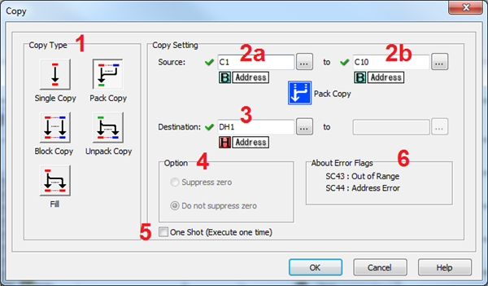
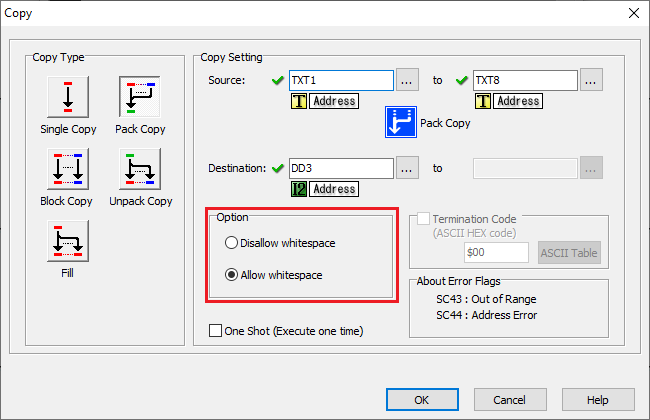
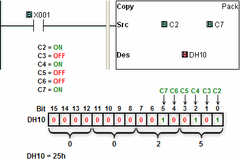
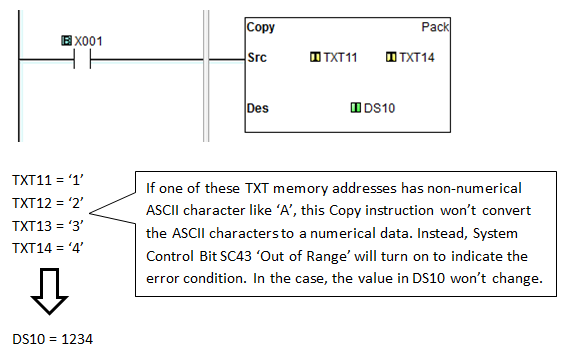
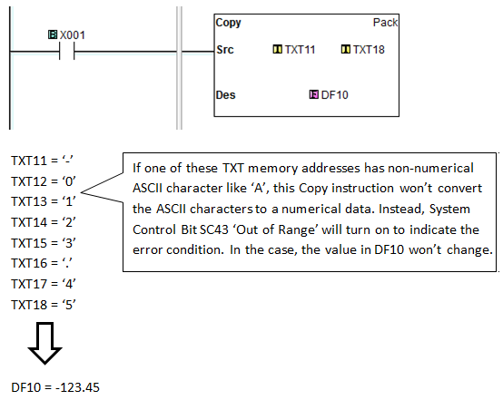

## Description

The **Pack Copy** mode of the **Copy Instruction** supports the following functions:

- Combine the status of up to **16 Source Bit Memory Addresses** (**X, Y, C, T, CT** or **SC**) and copy the combined status into a **Destination Data Register** (**DS** or **DH**).
- Combine the status of up to 32 Source Bit Memory Addresses (C) and copy the combined status into a Destination Data Register (DD or DF).
- Combine the status of two Single-Word Source Word Memory Addresses (DS or DH) and copy the combined status into a Double-Word Destination Data Register (DD or DF).
- Convert the numerical ASCII characters stored in a series of the **TXT Memory Addresses** to numerical data and store into a **Destination Data Register** (**DS, DD, DH, DF, TD** or **CTD**).

Please refer to the example programs on the bottom of this help topic.

- Destination
- Bits Registers
- Y C DS DD DH DF YD TD CTD SD TXT
- Source Bits X, Y, T, CT, SC ●
- C ● ● ● ●
- Registers DS ● ●
- DD
- DH ●
- DF
- XD, YD, TD, CTD
- SD
- TXT ● ● ● ● ● ● ●
- Constant Decimal, Hex
- String, ASCII Code

 

1Copy Type: Select Pack Copy to copy from a range of data to a single Memory Address.

2a Source: Enter a BitMemory Address that represents the start of a range of a Bit Memory Address, Word Memory Address or **TXT Memory Address**.

2b Source: Identify the ending Source Memory Address. The ending Source Memory Address must be the same type as the beginning Source Memory Address.

3 Destination: Identify the Destination Memory Address. If you selected a series of **X, Y, C, T CT** or **SC Memory Addresses** as the **Source**, select a **DS**, **DD**, **DH** or **DF****Memory Address** as the **Destination**. If you selected a series of **TXT Memory Addresses** as the source, select a **DS**, **DD**, **DH**, **DF**, **TD** or **CTD Addresses** as the **Destination**.

4 This Option field is not used in this mode.

5 One Shot: Choose One Shot to execute the Pack Copy instruction one time when the enabling rung makes an OFF-to-ON transition. If One Shot is selected, the One Shot symbol will appear adjacent to the Coil in the Ladder Editor.

6**About Error Flag: SC43** and **SC44** are **Error Flags** available for use in your program. **SC43 Out of Range** is valid for Single, Block, and Pack Copy modes. **SC44 Address Error** is valid for Single Copy mode when using a Pointer Address.

- **Note**: If one of those **TXT Memory Addresses** has non-numerical ASCII character like ‘A’, this **Copy instruction** won’t convert the ASCII characters to a numerical data. Instead, **System Control Bit SC43 ‘Out of Range’** will turn on to indicate the error condition.

- **Note**: C0-1x and C2-x CPUs have an additional Option of **Allow whitespace** when converting ASCII TXT registers into a numeric register. Leading and Trailing spaces of the Source are ignored.

## Example Programs

Example Program: Pack Copy a Range from C2 to C7

In the following example, when X001 is ON, the Source range C2 through C7 is loaded in Memory Address DH10.

**Example Program 2: Pack Copy numerical data (integer) from TXT11 to TXT14**

In the following example, when **X001** is **ON**, the numerical ASCII characters stored from **TXT11** to **TXT15** are converted to a numerical data and loaded in **Memory Address DS10**.

**Example Program 3: Pack Copy numerical data (floating point) from TXT11 to TXT18**

In the following example, when **X001** is **ON**, the numerical ASCII characters stored from **TXT11** to **TXT18** are converted to a numerical data and loaded in **Memory Address DF10**.

## TXT to DF Examples

TXT1-TXT6 = “-12.34”, DF=-12.34

TXT1-TXT6 = “+12.34”, DF=12.34

TXT1-TXT6 = “ 12.34”, SC43 Out of Range = True, Leading Space not allowed.
(Allow whitespace enabled, DF=12.34)

TXT1-TXT6 = “12.34 ”, SC43 Out of Range = True, Trailing Space not allowed. (Allow whitespace enabled, DF=12.34)

TXT1-TXT6 = “12,345”, SC43 Out of Range = True, Thousands separator not allowed.

TXT1-TXT6 = “-01234”, DF=-1234

TXT1-TXT6 = “1234e2”, DF=123400

TXT1-TXT6 = “1234E2”, DF=123400

TXT1-TXT6 = “123e-2”, DF=1.23

TXT1-TXT10 = “-01234e-02”, DF=-12.34

 

## TXT to DS, DD, TD, or CTD Examples

TXT1-TXT6 = “123456”, DD=123456

TXT1-TXT6 = “-12345”, DD=-12345

TXT1-TXT6 = “+12345”, DD=12345

TXT1-TXT6 = “000123”, DD=123

TXT1-TXT6 = “ 12345”, SC43 Out of Range = True, Leading Space not allowed.
(Allow whitespace enabled, DD=12345)

TXT1-TXT6 = “12345 ”, SC43 Out of Range = True, Trailing Space not allowed. (Allow whitespace enabled, DD=12345)

TXT1-TXT6 = “12,345”, SC43 Out of Range = True, Comma separator not allowed.

TXT1-TXT6 = “12.345”, SC43 Out of Range = True, Period separator not allowed.

TXT1-TXT6 = “1234e2”, SC43 Out of Range = True, Exponential notation not allowed.

 

## TXT to DH Examples

TXT1-TXT4 = “1234”, DH=0x1234

TXT1-TXT4 = “abcd”, DH=0xABCD

TXT1-TXT4 = “ABCD”, DH=0xABCD

TXT1-TXT4 = “ ABC”, SC43 Out of Range = True, Leading Space not allowed.
(Allow whitespace enabled, DH=ABC)

TXT1-TXT4 = “ABC ”, SC43 Out of Range = True, Trailing Space not allowed. (Allow whitespace enabled, DH=ABC)

TXT1-TXT6 = “A,BC”, SC43 Out of Range = True, Comma separator not allowed.

TXT1-TXT6 = “A.BC”, SC43 Out of Range = True, Period separator not allowed.

### Related Topics:

[Single Copy](copy_single.md) 
[Block Copy](copy_block.md) 
[Fill](copy_fill.md) 
[Unpack Copy](copy_unpack.md)
