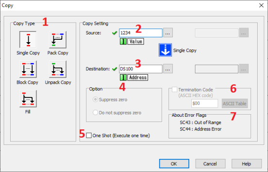
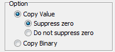
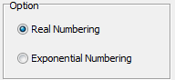
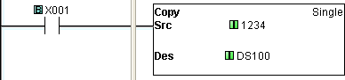
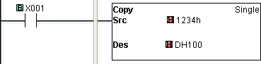
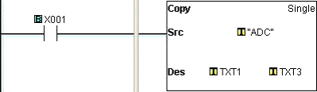
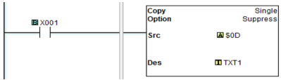
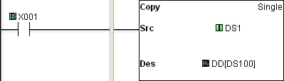

## Definition

The SingleCopy instruction is
 used to copy a data or text value from its Source location to a specified Destination register. The Source location of the data or text can be another register, identified
 by its MemoryAddress, or it can be a
 constant value typed directly into the Source field on the dialog. The Single
 Copy instruction allows you to copy numerical text
 values to one or more data registers as integer values.

- Destination
- Bits Registers
- Y C DS DD DH DF YD TD CTD SD TXT
- Source Bits X, Y, T, CT, SC ● ●
- C ● ●
- Registers DS ● ● ● ● ● ● ● ● ●
- DD ● ● ● ● ● ● ● ● ●
- DH ● ● ● ● ● ● ● ● ●
- DF ● ● ● ● ● ● ● ● ●
- XD, YD, TD, CTD ● ● ● ● ● ● ● ● ●
- SD ● ● ● ● ● ● ● ● ●
- TXT ● ● ● ● ● ● ● ● ●
- Constant Decimal, Hex ● ● ● ● ● ● ● ● ●
- String, ASCII Code ●

## Setup

1Copy Type: Select Single Copy to copy
 one Source value to
 a Destination location.

- Note: In the case of text Source values, a single text string is copied to a specific number
 of consecutive registers. The number of registers is equal
 to the number of characters, including spaces, in the Source text string. (See
 example below.)

2 Source: Identify the Source Memory
 Address or type a constant data or text value directly
 into the **Source** field. (See [Data Types](data_types.md) for the required typing conventions.)

3 Destination: Identify the Memory Address to which the data or text is to be copied. The Destination address must accommodate the Data
 Type of the Source entry.

4 Option: This Option is used with certain combinations of Source and **Destination Data Types**.

4a When the **Source** is **Numeric** and the **Destination** is **Text**: 

 

 **Source** = DS1 (The value is 123.) 
 **Destination** = TXT1 
The option ‘**Suppress zero**’ is selected: TXT1-TXT3=”123” 
The option ‘**Do not Suppress zero**’ is selected: TXT1-TXT5=”00123” 
The option ‘**Copy Binary**’ is selected: TXT1=”{“ (123d or 7Bh)

4b When the **Source** is **Text** and the **Destination** is **Numeric**:

 
**Source**: TXT1 (The value is ‘5’) 
**Destination**: DS1 
The option ‘**Copy Character Value**’ is selected: DS1=5 
The option ‘**Copy ASCII Code Value**’ is selected: DS1=53 (35h)

4c When the **Source** is **Float** and the **Destination** is **Text**:

 

 **Source** = DF1 (The value is 10000) 
 **Destination** = TXT1 
The option '**Real Numbering**’ is selected: TXT1-TXT13=”10000.0000000” 
The option ‘**Exponential Numbering**’ is selected: TXT1-TXT13=”1.0000000E+04”

5 One Shot: Choose **One Shot** to execute the **Single Copy** instruction one time when the enabling rung makes an **OFF-to-ON** transition. Otherwise the instruction will execute every scan. If **One Shot** is selected, the **One Shot** symbol will appear adjacent to the **Coil** in the **Ladder Editor**.

6 Termination Code: This option is supported by **C0-1x** and **C2-x** CPUs. When the Destination is Text Registers the Termination Code option becomes available. A single termination character can be added to the length of the Destination. Click on the checkbox to select and enter the ASCII Code in the field. Click on the ASCII Table button to open the ASCII Table shown below. Use this table to quickly select the desired ASCII Code.

 7**About Error Flag**: **SC43** and **SC44** are **Error Flags** available for use in your program. **SC43 Out of Range** is valid for Single, Block, and Pack Copy modes. **SC44 Address Error** is valid for Single Copy mode when using a Pointer Address. The **Source** or **Destination** Pointer Address is out of range of the memory type.

- Note: When
 the Source is a DH address type and the
 option 'Do not Suppress zero' is
 selected, the value in the DH address
 is copied into 4 TXT addresses.
Example:
Source: DH1 (The value is 12h.)
Destination: TXT1 (1) The option 'Suppress
 zero' is selected: TXT1 = '1', TXT2 = '2' (2) The option 'Do
 not Suppress zero'' is selected: TXT1 = '0', TXT2 = '0', TXT3
 = '1', TXT4 = '2'

## Example Program

Example
 Program 1: Copy Decimal Data Constant

In the following example, when X001 is ON,
 the decimal constant, 1234,
 is copied to the Memory Address:
 DS100.

Example Program
 2: Copy Hex Constant

In the following example, when X001 is ON,
 the hexadecimal constant, 1234h,
 is copied to the Memory Address:
 DH100.

Example Program
 3: Copy Text

In the following example, when X001 is ON,
 the text value "ADC" is copied to the Memory Addresses:
 TXT 1 through TXT3.

Example
 Program 4: Copy an ASCII Code

In the following example, when X001 is **ON**, **ASCII** character $0D (CR) is copied to TXT1. See [ASCII Table](ascii_table.md) for the entire **ASCII** codes.

Example
 Program 5: Using Pointer Addressing

In the following example, DD[DS100] is the [Pointer Addressing](pointer_addressing.md).
 When DS100 = 10, DD[DS100] is identical
 to DD10. When X001 is ON,
 the data in DS1 is
 copied to DD10.

### Related Topics:

[Block Copy](copy_block.md) 
[Fill](copy_fill.md) 
[Pack Copy](copy_pack.md) 
[Unpack Copy](copy_unpack.md)

[Casting Datatypes](casting.md)

[Pointer Addressing](pointer_addressing.md)
