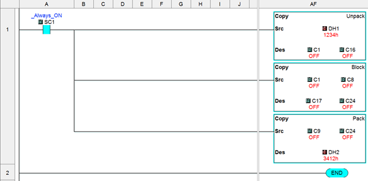
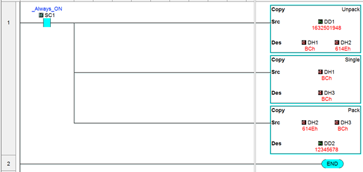
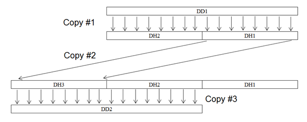

## Byte Swap Example

A Byte Swap operation can be created by combining instructions to move the data as needed. The following example uses DH registers, but the same idea can apply to all 16-bit registers: DS, DH and SD.

1. Copy #1 – [Copy Unpack](copy_unpack.md) from the 16-bit register into 16 C-bits.
2. Copy #2 - [Copy Single](copy_single.md) the Low Byte above the High Byte.
3. Copy #3 – [Copy Pack](copy_pack.md) 16 C-bits into a single 16-bit Register.

## Word Swap Example

A Word Swap operation can be created by combining instructions to move the data as needed. The following example uses DD registers, but the same idea can apply to all 32-bit registers: DD, DF and CTD.

1. Copy #1 – [Copy Unpack](copy_unpack.md) 32-bits into two 16-bit registers.
2. Copy #2 –[Copy Single](copy_single.md) the Low Word above the High Word.
3. Copy #3 – [Copy Pack](copy_pack.md) two 16-bit registers into a single 32-bit register.

 

### Related Topics:

[Single Copy](copy_single.md) 
[Block Copy](copy_block.md) 
[Pack Copy](copy_pack.md) 
[Unpack Copy](copy_unpack.md)

 
