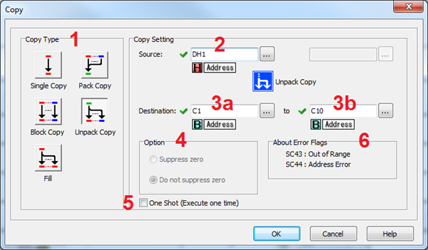
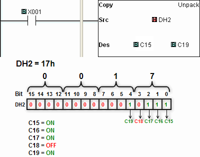

## Definition

The Unpack Copy mode of the Copy Instruction supports the following functions:

- Separate the status of a **Source Data Register** (**DS** or **DH**) and copy into up to 16 **Destination Bit Memory Addresses** (**Y** or **C**).
- Separate the status of a **Source Data Register** (**DD** or **DF**) and copy into up to 32 **Destination Bit Memory Addresses** (**Y** or **C**).
- Separate the Double-Words **Source Data Register** (**DD** or **DF**) and store into two Single-Word **Destination Word Memory Addresses** (**DS** or **DH**).

Refer to the example programs at the end of this Help topic.

- Destination
- Bits Registers
- Y C DS DD DH DF YD TD CTD SD TXT
- Source Bits X, Y, T, CT, SC
- C
- Registers DS ●
- DD ● ● ●
- DH ● ●
- DF ● ● ●
- XD, YD, TD, CTD
- SD
- TXT
- Constant Decimal, Hex
- String, ASCII Code

 

 

## Setup

1 Copy Type: Select Unpack Copy to copy from a single Memory Address.

2 Source: Enter a DS or DH Memory Address (DD or DF Double-Word that has the data to Copy to the destinations.

3a Destination: For Word Sources, enter the starting C or Y Address. For **Double-Word** sources, enter the starting C, Y, DS, or DH Address.

3b Destination: Enter the ending address (Max 32 consecutive **Bit** addresses or 2 consecutive **Word** addresses.).

4**Option:** The **Option** field is not used in this mode.

5 One Shot: Choose One Shot to execute the Pack Copy instruction one time when the enabling rung makes an OFF-to-ON transition. If One Shot is selected, the One Shot symbol will appear adjacent to the Coil in the Ladder Editor.

6**About Error Flag:****SC43** and **SC44** are **Error Flags** available for use in your program. **SC43 Out of Range** is valid for Single, Block, and Pack Copy modes. **SC44 Address Error** is valid for Single Copy mode when using a Pointer Address.

## Example Program

Example Program: Unpack Copy a Range to C15 through C19

In the following example, when X001 is ON, the SourceDH2 is copied to Destinations C15 through C19.

### Related Topics:

[Single Copy](copy_single.md) 
[Block Copy](copy_block.md) 
[Fill](copy_fill.md)[Pack Copy](copy_pack.md) 
[Casting Datatypes](casting.md) 
[Pointer Addressing](pointer_addressing.md)
