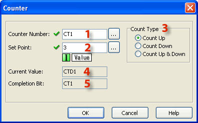
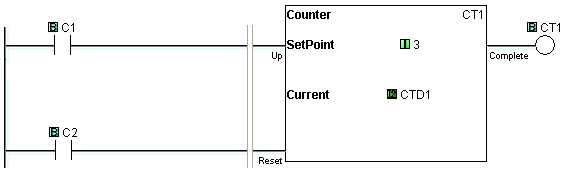
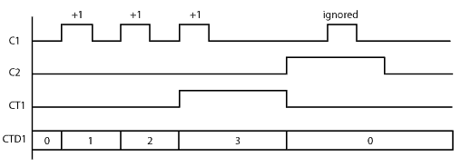
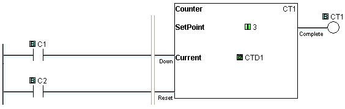
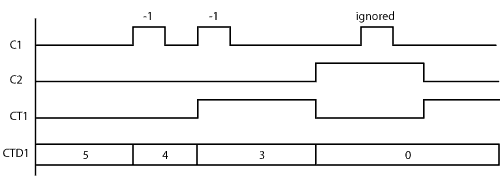
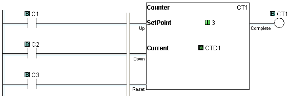
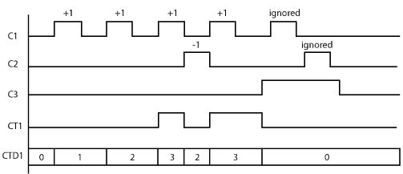

## Definition

When enabled, a Counter instruction counts up or down (depending on user settings) until it reaches the Set Point. The Counter counts in response to the transition from OFF to ON of the enabling rung. If the user selects Count Up & Down, the Counter will have two enabling rungs, one for up counts and one for down counts.

The current count is held in the register shown in the Current Value field. When the Current Value reaches the Set Point, the Completion Bit is turned ON. The Completion Bit is turned OFF when the Reset rung is enabled.

## Setup

1 Counter Number: Assign a Counter Number. This number can only be the CT Memory type. Either type the CT number directly into the Counter Number field or click the Browse Button to open the Address Picker.

2 Set Point: Enter a Constant (Integer only). Or, assign a Data Memory Address to hold the Set Point value. DS and DD are the eligible [Data Memory Address](memory_addresses.md) range.

3 Count Type: Use the radio buttons to select **Count Up**, **Count Down**, or **Count Up & Down**.

4 Current Value: When the Counter Number is assigned (see 1 above), the Current Value is automatically assigned to the corresponding Counter Data register. CT1 corresponds to CTD1, CT2 corresponds to CTD2, etc.

5 Completion Bit: The Completion Bit is the same as the Counter Number.

## Example Program

Example Program 1: Up Counter

In the following example, after C1 makes OFF-to-ON transition 3 times, the counter CT1 counts up and the counter status bit CT1 is turned ON. When C2 is ON, the counter is Reset and does not accept the count up signal.

Timing Diagram

Example Program 2: Down Counter

In the following example, the current counter value CTD1 is set to 5 in the beginning. After C1 makes OFF-to-ON transition 2 times, the current counter value CTD1 reaches the Set Point (3 in this example) and the counter status bit CT1 is turned ON. When C2 is ON, the counter is reset. (**CT1** is **OFF** and **CTD1** is set to **0**.) However, CT1 is turned on immediately after C1 is turned off because the current counter value CTD1 is lower than the Set Point.

Timing Diagram

Example Program 3: Up/Down Counter

In the following example, when C1 makes an OFF-to-ON transition, the current counter value CTD1 increases by one. When C2 makes an OFF-to-ON transition, the current counter value CTD1 decreases by one. When the current counter value CTD1 is the same or more than the Set Point (3 in this example), the counter status bit CT1 is ON. When C3 is ON, the counter is reset. (CT1 is OFF and CTD1 is set to 0.)

Timing Diagram

### Related Topics:

[Memory Addresses](memory_addresses.md)
