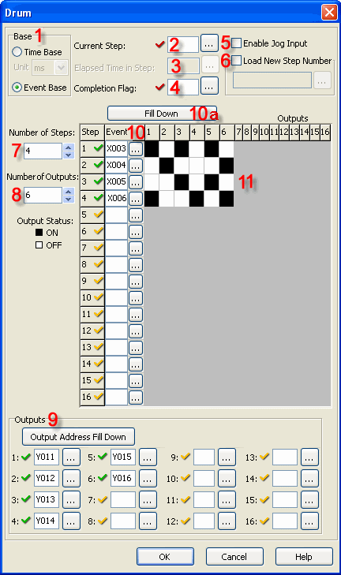
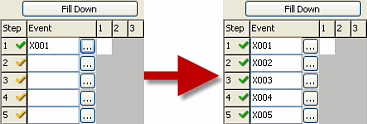
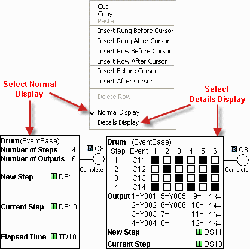
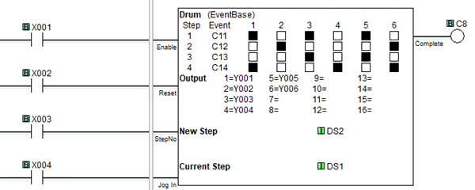
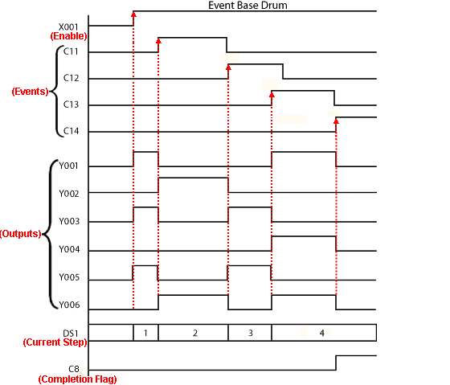
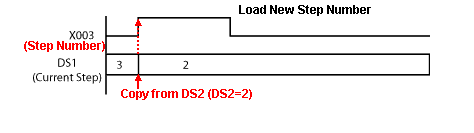

## Definition

The Drum instruction simulates an electromechanical drum sequencer, using either a [Time Base](drum_time.md) or an Event Base sequencing strategy. Each Drum instruction is capable of sequencing through 1 to 16 steps and turning ON as many as 16 outputs in a user defined pattern. Outputs can be either physical outputs or internal control relays. A Flag Bit is turned ON to indicate the completion of the sequence.

## Event Base Setup

1 Base: The Drum instruction operates either on a Time Base or an Event Base. If Event Base is selected, the time increment drop down list is grayed out.

2 Current Step: Identify the Memory Address where the Current Step number will be stored.

3 Elapsed time in step: (This parameter is not used in the Event Base mode. Therefore, it has been grayed out since CLICK Programming Software Version 1.11.)

4 Completion flag: Assign a Control Relay (C bit) to be the Completion Flag.

5 Enable Jog Input: Selecting Enable Jog Input turns on an additional rung that allows the user to jump to the next Step each time the Jog rung transitions from OFF-to-ON.

6 Load new step number: Selecting Load New Step turns on an additional rung that allows the user to jump to a specified Step in the sequence. Assign a Memory Address to hold the desired Step Number.

7 Number of Steps: Select a number from 1 to 16. This will determine the number of steps in the sequence.

8 Number of Outputs: Select a number from 1 to 16. This will determine the number of outputs available during the sequence.

9 Outputs: Assign Outputs. Outputs can be physical Outputs and/or internal control relays. The number of Outputs should match the number chosen at item 8, above. 
You can use the Output Address Fill Down button  to enter consecutive Addresses automatically. Enter the first Memory Address and keep clicking the Output Address Fill Down button.

10 Event: Assign the bit-level Memory Address that will initiate each Step. The number of Steps will match the number chosen at 7, above.
> 10a Fill Down: The Fill Down button  will enter consecutive Addresses automatically. Enter the first Address and keep clicking the Fill Down button.

11 Output Pattern: Click in the grid to develop the sequence the Drum instruction will follow. Each cell corresponds to a combination of one Step number and one Output number.

## Normal or Detail Display

- Note: Right click the rung symbol to open the pop-up menu and toggle between Normal Display and Details Display.

## Example Program

Example Program: Event Base

In the following example:

- When **X001** is **ON**, the Drum instruction is enabled and **Step 1** begins. The outputs corresponding to Step 1 will turn ON and remain ON until Step 1 ends.
- When **C11** turns **ON**, Step 1 ends and Step 2 begins. C12, C13, and C14 end Steps 2, 3, and 4.
- **X001** must remain **ON** to enable the sequence to continue.
- At the end of **Step 4**, the sequence is complete, and the C8 bit turns ON.
- If **X003** turns **ON**, the Drum instruction jumps to the step number loaded in DS2.
- If **X004** turns **ON**, the Drum instruction jumps to the next step in the sequence.

### Related Topics:

[Drum Instruction: Time Base](drum_time.md) 
[Memory Addresses](memory_addresses.md) 
[Data Types](data_types.md)
