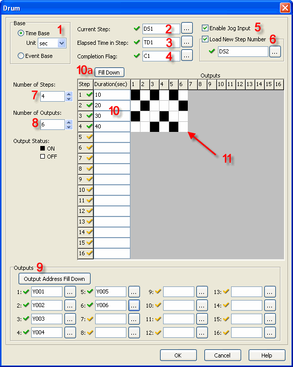
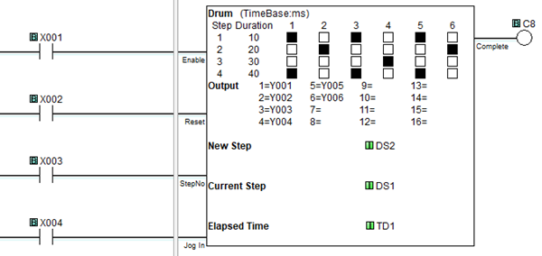
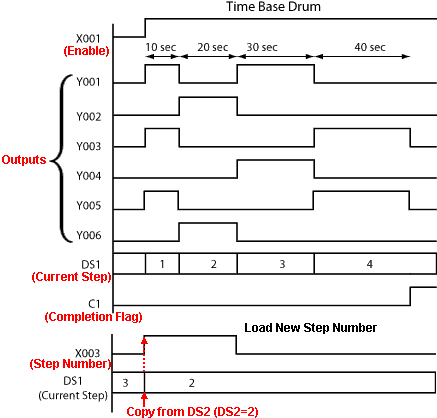

## Definition

The Drum instruction simulates an electromechanical drum sequencer, using either a Time Based or an [Event Base](drum_event.md) sequencing strategy. Each Drum instruction is capable of sequencing through 1 to 16 steps and turning ON as many as 16 outputs in a user defined pattern. Outputs can be either physical outputs or internal control relays. A Flag Bit is turned ON to indicate the completion of the sequence.

## Setup

1 Base: The Drum instruction operates either on a Time Base or an Event Base. If Time Base is selected, the increment of time is also chosen from the drop down list. The available time increments are milliseconds, seconds, minutes, hours, or days.

2 Current Step: Identify the Memory Address where the Current Step number will be stored. This must be a DS type Memory Address.

3 Elapsed time in step: Identify the Memory Address where the Elapsed Time in Step will be stored. This must be a TD Type Memory Address.

4 Completion flag: Assign a Control Relay (C bit) to be the Completion Flag.

5 Enable Jog Input: Selecting Enable Jog Input turns on an additional rung that allows the user to jump to the next Step each time the Jog input transitions from OFF-to-ON.

6 Load New Step Number: Selecting Load New Step turns on an additional rung "**Step No Input**" that allows the user to jump to a specified Step in the sequence. Assign a Memory Address to hold the desired newStep Number. This must be a DS type Memory Address.The **Step No Input** is edge triggered. When the **Step No Input** transitions from **OFF-to-ON**, the value of the new **Step Number** is copied to the **Current Step**.

7 Number of Steps: Select a number from 1 to 16. This will determine the number of steps in the sequence.

8 Number of Outputs: Select a number from 1 to 16. This will determine the number of outputs available during the sequence.

9 Outputs: Assign Outputs. Outputs can be physical Outputs and/or internal control relays. The number of Outputs should match the number chosen at item 8, above. 
You can use the Output Address Fill Down button  to enter consecutive Addresses automatically. Enter the first Memory Address and keep clicking the Output Address Fill Down button.

10 Duration: Assign a time Duration for each Step. The number of Steps should match the number chosen at item 7, above.

10a Fill Down: The Fill Down button  may help you enter the time Durations quickly.

### Example 1: Fill with the same Time Duration

### Example 2: Fill with Increasing Time Durations

11 Output Pattern: Click in the grid to develop the sequence the Drum instruction will follow. Each cell corresponds to a combination of one Step number and one Output number.

## Normal or Details Display

- Note: Right click the rung symbol to open the pop-up menu and toggle between Normal Display and Details Display.

## Example Program

Example Program: Time Base

In the following example, when X001 is ON, the Drum instruction begins its sequence at Step 1. If X001 remains ON, the sequence will continue until complete, unless interrupted by X002, X003 or X004. The duration of Step 1 was assigned to be 10 seconds on the Setup Dialog. Step 2 is 20 seconds in duration, Step 3 is 30 seconds, and Step 4 is 40 seconds. At the end of Step 4, the sequence is complete, and the C1 bits turns ON. X002 must turn ON to Reset the Drum instruction. If X003 turns ON, the Drum instruction jumps to the step number loaded in DS2. If X004 turns ON, the Drum instruction jumps to the next step in the sequence.

  

### Related Topics:

[Drum Instruction: Event Base](drum_event.md) 
[Memory Addresses](memory_addresses.md) 
[Data Types](data_types.md)
