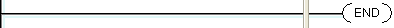
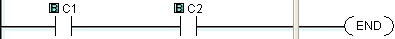

## Definition

The End instruction marks the termination point of the normal program scan. The Main program must have an End instruction to tell the CPU that there are no more rungs to be processed. The End instruction cannot reside in a Subroutine or Interrupt program.

## Specifications

The End instruction can be Unconditional or Conditional.

1. Unconditional End:Unconditional End means that there is no Contact on the rung including the End instruction. So the End instruction is always executed.

1. Conditional End: Conditional End means the rung including an End instruction has Contacts. These Contacts decide when the End instruction is executed.

- Caution: The Main Program needs to have at least one Unconditional End instruction. There is No Limit on the number of Conditional or Unconditional End instructions.

The End instruction does not require a dialog for setup. The placement of the End instruction in the appropriate Coil Area location is achieved by one of several simple methods:

1. Drag and Dropthe instruction from theInstruction List
2. Placing theBox Cursor in the rung position where you want the End Instruction to appear and:
 1. Type the letter "e" or "E"
 2. Select [Instruction > Program Control > End](popup_instr_prog_end.md)
