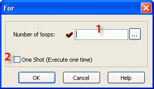
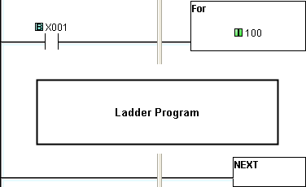

## Definition

The For instruction indicates
 the starting point of a For
 - Next loop, and based on its user setting, determines
 how many times the For -
 Next loop will be executed in one program scan. Between
 the For instruction
 rung and the Next instruction rung, place the rungs of logic that should be
 repeated multiple times.

- Caution: Placing one For-Next loop inside another For-Next loop is NOT permitted.

## Setup

1 Number
 of loops: The Number
 of loops can be a constant typed directly or it can
 be any eligible Data Memory
 Address.

- Note: If the Number of Loops setup is large, it will increase the program scan time. When
 the program scan time exceeds the Watchdog
 Timer setup (Default = 200ms),
 the CLICK PLC drops
 from the Run mode.
 You may increase the [Watch Dog Timer](061.md) setup.

2 One Shot: Select the One Shot by clicking the check box.
 If One Shot is selected,
 the For-Next Loop will
 be processed (all loops) one time after being enabled. The For-Next Loop will not
 be executed again until there is another OFF-to-ON transition by the enabling
 contact.

## Example Program

Example
 Program: For-Next Loop

In the following example, when X001 is ON, the Ladder
 Program is executed 100 times in one same program scan.

### Related Topics:

[Next Instruction](next.md)
