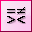
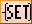
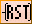
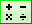
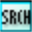

## Description

The Instruction Menu is located on the [Main Menu](015.md) of this application.

![]"Resources/Images/CL076.png)"

## Contact Instructions

The Contact Instructions are used to provide an Input to Activate or Deactivate a rung. These Contacts are basically a virtual ON/OFF switch that can be configured to operate as needed. The CLICK Programming Software offers four Contact choices. To learn more about these Contacts, move the pointer over the Icon to see the name and click on the Icon to open the specific topic for that Contact.

## Coil Instructions

The Coil Instructions are used to provide an Output that responds directly to the state of the rung. The CLICK Programming Software currently offers four Coil choices. To learn more about these Coils, move the pointer over the Icon to see the name and click on the Icon to open the specific topic for that Coil.

## Timer/Counter Instructions

The Timer Instruction is used to provide an Output that responds according to a preset time value. The **Timer** starts timing when the when the rung is energized and can be configured to activate or deactivate the output when the preset time cycle is completed. The Counter Instruction is used to provide an Output that responds according to a preset count value. The **Counter** counts the **ON/OFF** transitions of the enabling rung to activate or deactivate the output when the preset count is completed.

To learn more about the Timer or Counter Instructions, move the pointer over the Icon to see the name and click on the Icon to open the specific topic for the instruction.

## Advanced Instructions

The Advanced Instructions include instructions that provide an Output based on mathematical calculations, sequences triggered by events or time, or register shifts triggered by a bit status depending how its been configured. The CLICK Programming Software offers three Advanced Instruction choices. To learn more about these instructions, move the pointer over the Icon to see the name and click on the Icon to open the specific topic for that instruction.

## Copy/Search Instructions

The Copy/Search Instructions include instructions that copy or search within registers. The CLICK Programming Software offers three Copy/Search Instruction choices. To learn more about these instructions, move the pointer over the Icon to see the name and click on the Icon to open the specific topic for that instruction.

](175.htm "Go to Call Instruction topic")](popup_receive_instructions.htm "Go to Receive Instruction topics")](294.htm "Go to Home for PTO Axis Instruction topic")[](296.htm "Go to Position Move for PTO Axis Instruction topic"

 
