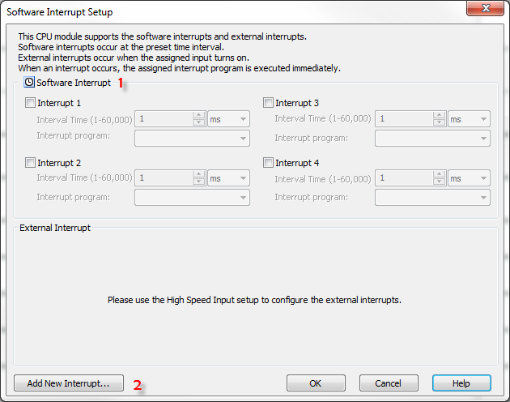
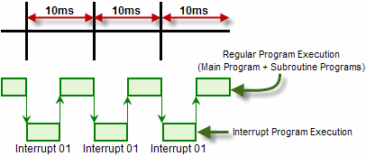
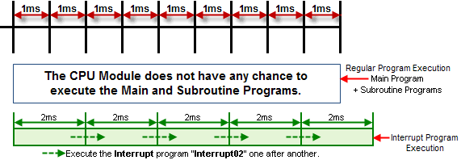
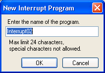
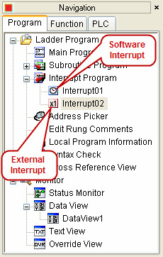

## Description

The Interrupt Setup allows
 users to setup the condition to execute the Interrupt
 Program that is triggered by the Software or by an External source.

1Software Interrupt: This portion of the window allows the setup of up to four
 different Interrupt Programs triggered by the Software.
 Click on the Interrupt checkbox to activate it. Enter an Interval
 Time value and click on the down arrow to select if
 the Time value is
 in Seconds or Milliseconds. Then
 click on the Interrupt Program down arrow to select an Interrupt
 Program to use. If none is available, go to [Item #2](#2) first to Add a New Interrupt Program. 

Example:Interrupt program "Interrupt01"
 is set as Software Interrupt at 10ms interval.

  

- Warning: If you set a small number as the Software
 Interrupt interval, please be careful if the Execution Time of the Interrupt Program will not
 exceed the Interval.
 See the example below.

Example:Interrupt program "Interrupt02"
 is set as Software Interrupt at 1ms interval, but
 it takes 2ms to execute
 the Interrupt program.

To
 avoid a situation like this one, please do not assign unnecessary
 short time periods as the software Interrupt interval. In addition, please make the Interrupt program simple if you want to set a short time period as the Software Interrupt.

2 **Add New Interrupt**: Click on this button to **Add a New Interrupt Program** to your project. When selected, the window shown below opens. From this window enter up to **24** characters for the name of the new **Interrupt Program** and click **OK** to accept it.

This creates the new **Interrupt Program**. **Interrupt Programs** can be found and accessed using the **Program** tab shown below. Double-click on the **Interrupt Program** to select and open it. For more information on **Adding New Interrupt Programs**, click on the green text. The **Interrupt Icons** indicate if the Interrupt is an **External** or a **Software Interrupt**.

### Related Topics:

[Add New Interrupt](071.md) 
[Quick Guide Interrupt](193.md)
