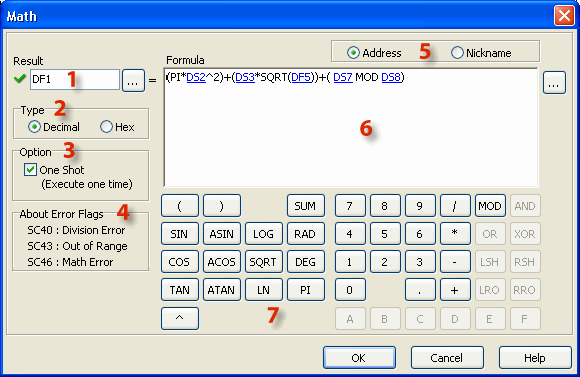
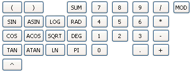
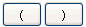
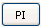
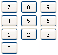
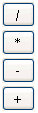
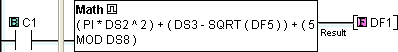

## Description

The Math instruction solves a user-defined formula during the execution of the Ladder Program. The formula is developed on the Math dialog using the on-screen keypad, the computer keyboard, and Address Picker. Two sets of mathematical operators are available. One set is appropriate for use with decimal values, and the other is for use with hexadecimal values. Also see [Math (Hex)](math_hex.md). Parenthetical expressions can be nested up to eight levels deep. If the Floating Point Data Type is used in any operation, then all operations will be based on Floating Point math. The solution will be stored in the data format selected for the Result.

## Decimal Setup

1 Result: Assign a Memory Address where the Result will be stored. The Result value will be adjusted to the data type of the Memory Address. Click the Browse Button to open Address Picker.

2 Type: Selecting Decimal or Hex determines the mathematical operations that are available on the Math instruction dialog. Most of the operators are unique to either Decimal or Hex math.

- Note: Changing this selection after beginning to develop the Formula will erase the Formula.

3 One Shot: Select One Shot to solve the formula only once after each OFF-to-ON transition of the enabling rung.

4 Error Flags: These System Bits turn ON when the specified condition has occurred.

5 Address or Nickname: Data Registers can be identified in the Formula by the Memory Address or the Nickname.

6Formula Pad: Create the mathematical expression using the onscreen keypad, the keyboard, and Address Picker. Click the Browse Button to open Address Picker.

7 Decimal Keypad: The Decimal Keypad includes numerical keys, Sum and Modulo operators, parentheses, and certain algebraic and transcendental operators. Trig functions can be solved in Radians.

## Decimal Keypad

| Key | Name | Definition | Usage Example |
| --- | --- | --- | --- |
|  | Left and Right Parentheses | Used for grouping terms. Must be used in pairs. | (DF1 + 5) |
|  | Sine | Sine Θ = opposite / hypotenuse Θ = Radian | SIN(DF1) SIN(RAD(DF1)) |
|  | Cosine | Cosine Θ = adjacent / hypotenuse Θ = Radian | COS(DF1) COS((RAD(DF1)) |
|  | Tangent | Tangent Θ = sine / cosine Θ = Radian | TAN(DF1) |
|  | Arc Sine | Inverse Sine | ASIN(DF1) |
|  | Arc Cosine | Inverse Cosine | ACOS(DF1) |
|  | Arc Tangent | Inverse Tangent | ATAN(DF1) |
|  | Power (Exponent) | a ^ b = a raised to the power b. | DF1^DF2 |
|  | Log (Base 10) | If x = b ^ y, y = log_bx | LOG(DF1) |
|  | Square Root | The Square Root of b is the number a if a * a = b. | SQRT(DF1) |
|  | Log (Natural) | If x = e ^ y, y = ln_bx | LN(DF1) |
|  | Summation | Adds a group of values in a specified range of Memory Addresses. | SUM(DF1:DF10) |
|  | Radians | Converts degrees to radians. radians = degrees * (pi/180) | RAD(DF1) |
|  | Degrees | Converts radians to degrees. degrees = radians * (180/pi) | DEG(DF1) |
|  | Pi | Constant that equals the ratio of a circle's circumference to its diameter. | 3.1415927 |
|  | Number Keys | The numbers 0 to 9. | 0123456789 |
|  | Decimal | Decimal notation, "." | 1.234 |
|  | Arithmetic Operators | Divide Multiply Subtract Add | DF1 / DF2 DF1 * DF2 DF1 - DF2 DF1 + DF2 |
|  | Modulo | a MOD b refers to the arithmetic remainder after a is divided by b. | DF1 MOD DF2 |
| | | | |

## Example Decimal Program

Example Program: Integer and Floating Point Math

In the following example, when C1 transitions from OFF-to-ON, the Formula is solved and the Result is stored in DF1 as a Floating Point number. The Result is converted to the Data Type of the assigned Memory Address.

### Related Topics:

[Hex Math Instruction](math_hex.md) 
[Data Types](data_types.md) 
[Memory Addresses](memory_addresses.md)
