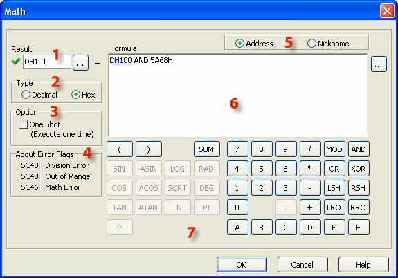
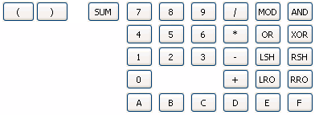
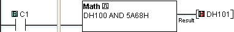
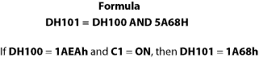
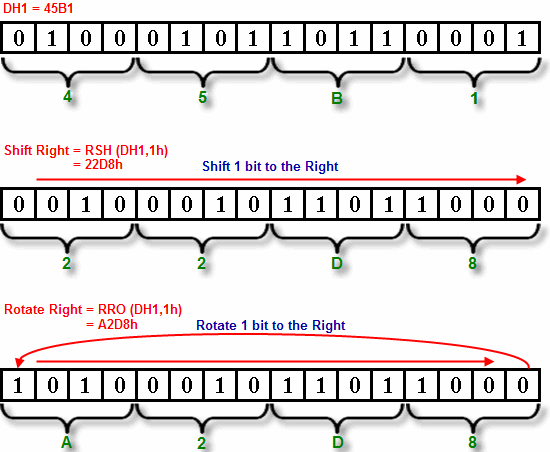

## Description

The Math instruction solves a user-defined formula during the execution of the Ladder Program. The formula is developed on the Math dialog using the onscreen keypad, the computer keyboard, and Address Picker. Two sets of mathematical operators are available. One set is appropriate for use with decimal values, and the other is for use with hexadecimal values. See also [Math (Decimal)](math_decimal.md). Parenthetical expressions can be nested up to eight levels deep. If the Floating Point Data Type is used in any operation, then all operations will be based on Floating Point math. The solution will be stored in the data format selected for the Result.

1 Result: Assign a Memory Address where the Result will be stored. The Result will be stored in the hex data format. Click the Browse Button to open Address Picker.

2 Type: Selecting Decimal or Hex determines the mathematical operations that are available on the Math instruction dialog. Most of the operators are unique to either Decimal or Hex math.

- Note: Changing this selection after beginning to develop the formula will erase the formula.

## Hex Setup

3 One Shot: Select One Shot to solve the formula only once after each OFF-to-ON transition of the enabling rung.

4 Error Flags: These System Bits turn ON when the specified condition has occurred.

5 Address or Nickname:Data Registers can be identified in the Formula by the Memory Address or the Nickname.

6 Formula Pad: Create the mathematical expression using the onscreen keypad, the keyboard, and Address Picker. Click the Browse Button to open Address Picker.

7 Hex Keypad: The Hex Keypad includes the numerical and letter keys to create Hex numbers, Sum and Modulo, parentheses, and certain logical operators and bit operators. See [Hex Keypad Details](#Details) below.

## Hex Keypad Details

- Key Name Definition Usage Example
- Left and Right Parentheses Used for grouping terms. Must be used in pairs. (DH1 + 5h)
- Summation Adds a group of values in a specified range of Memory Addresses. SUM(DH1:DH10)
- Number Keys 1h1234hAB59h
- Arithmetic Operators DivideMultiplySubtractAdd DH1 / DH2DH1 * DH2DH1 - DH2DH1 + DH2
- Modulo a MOD b refers to the arithmetic remainder after a is divided by b. DH1 MOD DH2
- OR Logical OR DH1 OR DH2
- LSH Shift Left LSH(DH1,1h)
- LRO Rotate Left LRO(DH1,1h)
- AND Logical AND DH1 AND DH2
- XOR Logical XOR DH1 XOR DH2
- RSH Shift Right RSH(DH1,1h)
- RRO Rotate Right RRO(DH1,2h)

## Example Hex Program

Example Program: Hex Math

In the following example, when C1 transitions from OFF-to-ON, the Formula is solved and the Result is stored in DH101 as a Hex number.

## Shift and Rotate

DH1 = 45B1

1. Shift Right: DH2 = RSH (DH1,1h) 
  DH2 = 22D8h
2. Rotate Right: DH2 = RRO (DH1,1h) 
  DH2 = A2D8h

### Related Topics:

[Decimal Math Instruction](math_decimal.md) 
[Data Types](data_types.md) 
[Memory Addresses](memory_addresses.md)
