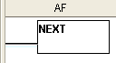

## Definition

The Next instruction indicates the end of a For Next loop. The Next instruction must be the only instruction on its rung. No enabling contacts are allowed on the same rung with the Next instruction.

## Setup

When the user selects the Next instruction from the Instruction List and drops it into the Ladder Editor at the specified position, the symbol below appears in the Ladder Editor at the specified position.

## Example Program

Example Program: For-Next Loop

In the following example, when X001 is ON, the Ladder Program is executed 100 times.

The Next instruction does not require a dialog for setup. The placement of the Next instruction in the appropriate Coil Area location is achieved by one of several simple methods:

1. Drag and Drop the instruction from theInstruction List
2. Placing theBox Cursorin the rung position where you want theNext instruction to appear and:
 1. Type the letter"n"or "N"
 2. Select [Instruction > Program Control > Next](popup_instr_prog_end.md)

### Related Topics:

[For Instruction](for.md)
