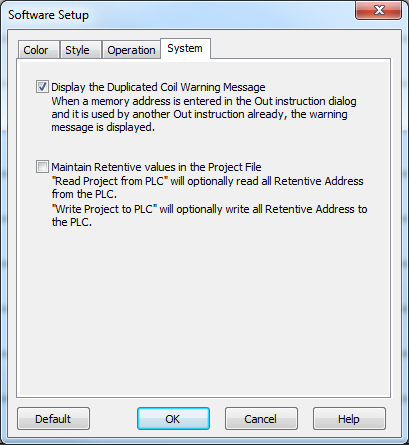
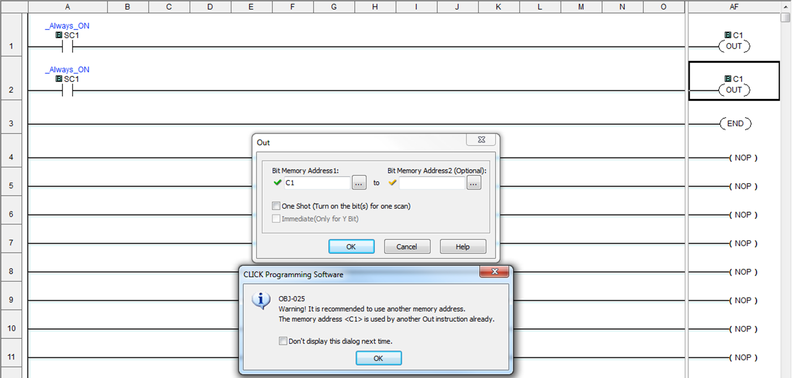
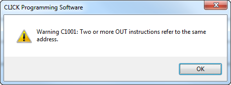
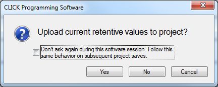
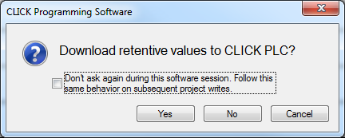

The **Software Setup****>****System** menu offers the options to **Display the Duplicated Coil Warning Message** and **Maintain Retentive values in the Project File**.

|  | **Note:** These options are software settings, not project settings. |
| --- | --- |

## Display the Duplicated Coil Warning Message

Whenever an OUT instruction is placed in the ladder and the **OK** button is clicked, a validation is performed to warn the user if a memory address is used in another OUT instruction. Having two OUT instructions to the same address is typically a poor practice, since only the last OUT scanned will actually control the output. This option allows the user to suppress this warning.

 

 

Selecting the **Don't display this dialog next time** checkbox is the same as disabling the feature in Software Setup: System.

 

Even with the **Display the Duplicated Coil Warning Message** option disabled, the Compiler will always report this warning.

## Maintain Retentive Values in the Project File

Normally, a project file only includes Initial Values for registers. With this option enabled. the software will automatically prompt the user during Project transfers to either Retrieve or Write values of Retentive registers. By using this option and **Read Project from PLC**, the project file will contain an exact copy of the PLC: User Program, Parameter, Project File, and Retentive Registers. In this way it is easy to duplicate an operating PLC without needing to manually initialize memory values.

|  | **Note:** If the project file was excluded during the previous "Write Project into PLC", the **Read Project from PLC** cannot be performed, and this Retentive feature is also unavailable. The other feature, **Read Data from PLC**, can still be used to retrieve the current register values. |
| --- | --- |

 

If you don't want to see the Upload and Download confirmations, click the checkbox on this dialog. These confirmations will be restored each time the programming software is started.

 

### Defaults

In a default project, these Address Types are set as Retentive: C, CT, DS, DD, DH, DF, CTD, TXT.

The default behavior when **Write Project into PLC** is that no memory values are sent.

The default behavior when **Read Project from PLC** is that no memory values are retrieved.

Any Stop to Run transition will cause addresses configured for Initial Values to be updated.

|  | **Notes:** These options are software settings, not project settings. The Retentive and Initial Value settings for each Address can be edited in the Address Picker. This feature is not available in combination with the Project Loader. |
| --- | --- |

### Related Topics:

[Address Picker: Edit Mode](072.md)

[Read Data From PLC](087.md)

[Write Data into PLC](088.md)

 
