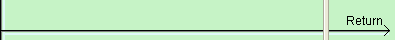
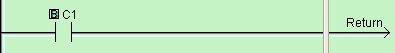

## Definition

The Return instruction is used to return to the Main Program from a Subroutine Program or Interrupt Program. The Return instruction can be Conditional or Unconditional. Conditional means the rung including a Return instruction has Contacts. Unconditional means that there is no Contact on the rung including the Return instruction.

- Note: The Return instruction is available from the Instruction Menu or the Instruction List, but it is only visible on the Instruction List when viewing a Subroutine Program or Interrupt program.

## Setup

Position the Box Cursor on the Coil Area of the rung you have selected. This will be the enabling rung for the Return instruction. Select Return from the [Instruction Menu > Program Control](popup_instr_prog_ret.md) or the Instruction List. The Return instruction is only visible on the Instruction List when viewing the Main Program.

## Return Instruction Examples

Example Program 1: Unconditional Return

When this rung is executed, the Program execution goes back to the Main Program.

- Caution: Any Subroutine Program and Interrupt Program must have an Unconditional Return.

Example Program 2: Conditional Return

When C1 is ON, the Program execution goes back to the Main Program.

### Related Topics:

[Call Instruction](call.md) 
[Quick Guide Subroutine](112.md) 
[Quick Guide Interrupt](193.md)
