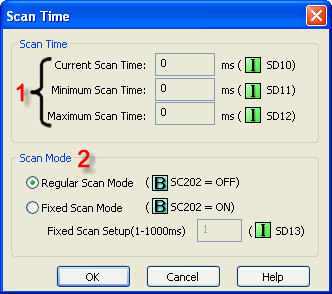
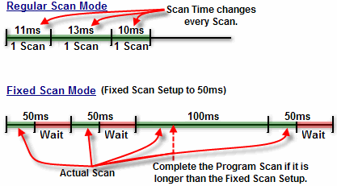

## Description

Scan Time refers to the amount of Time that CPU takes to execute the Ladder Program, Read Input, Update Output Status and Support Communication. Therefore, the larger the program is, the longer the Scan Time will be. CLICK CPUs offer two types of Scan control modes:

During a Regular Scan Mode, the CPU attempts to complete each Scan as quickly as possible. Scan Time may vary every Scan.

During a Fixed Scan Mode, the CPU completes every Scan at the interval of the Fixed Scan Setup. If the actual Scan Time is longer than the Setup, the CPU ignores the Fixed Scan Setup and will complete the Scan.

## Setup

1 Scan Times: This portion of the window shows the values for the Current Scan Time, the Minimum Scan Time and the Maximum Scan Time since the CLICK PLC was put in Run Mode or Powered Up. All values are displayed in milliseconds. These registers are read-only therefore, no editing is possible.

2 Scan Mode: Select Regular Scan Mode or Fixed Scan Mode. IfFixed Scan mode is selected, enter the Fixed Scan Setupvalue.

- Note: The new setup won't be applied until the project is downloaded into the CLICK PLC.

## Scan Time Example

### Related Topics:

[Navigation Window - Function Tab](134.md)
