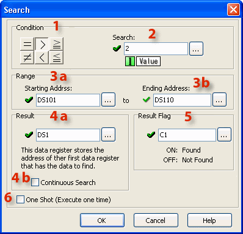
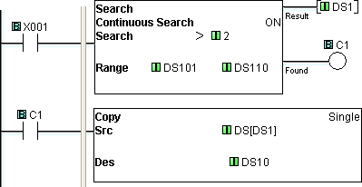
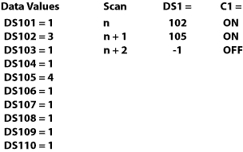
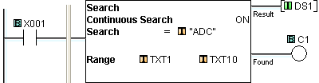
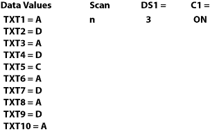

## Definition

The Search instruction is used to search for a data value that meets the specified condition and that is located within a specified range of data registers. A successful search returns the Memory Address of the value that satisfies the condition.

## Setup

1 Condition: Establish the condition you want the searched item to satisfy.

2 Search: Set the value to accompany the Condition. This value can be a constant or a Data Register.
> 3a Starting Address: Set the Starting Address of the range you want to search within.
>
> 3b Ending Address: Set the Ending Address of the range you want to search within.
>
> 4a Result: Assign a Data Register to receive the Search Result. If the Search was not successful, "-1 (minus one)" is put in the Data Register.
>
> 4b Continuous Search: 
>
>
>
>
> > Continuous Search = OFF
> >
> > The Search always starts from the Starting Address. If there is no data that matches the condition, "-1" will be put in Memory Address assigned to store the Search result.
> >
> > Continuous Search = ON
> >
> > The Search is continued from the next address after a successful Search. Once all instances that satisfy the Search criteria are found, "-1" will be put in memory address assigned to store the Search result. Put Zero in the memory address storing the Search result to re-start the Search from the Starting Address of the Search Range.

5 Result Flag: The Result Flag notifies the user that the Search criteria were met.

6 One Shot: Checking One Shot causes the instruction to execute one time when the enabling rung transitions from OFF to ON.

## Example Program

Example Program 1: Search and Copy Result

In the following example, when X001 is ON, the memory range from DS101 to DS110 is searched for a value greater than 2. On the first scan, the search begins at DS101 and continues until a value greater than 2 is found or until the range of Memory Addresses is exhausted. If the search locates a value greater than 2, the search is stopped until the next scan and the Memory Address of the qualifying value (first value greater than 2) is written to DS1. Flag bit, C1, turns ON to indicate a successful search and turns ON the Copy instruction in the next rung. Using Pointer Addressing the value contained in the Memory AddressDS1 is Copied to DS10.

Scan Sequence

Example Program 2: Search for Text

In this example, when X001 is ON, the memory range from TXT1 to TXT10 is searched for a text value equal to "ADC." Each letter is contained in a single 8-bit register, so the search is looking for a text string comprised of three consecutive registers which contain the letters: A, D, and C. A successful search returns the beginning memory address (the location of "A") to DS1 and turns ON the Flag bit, C1.

Scan Sequence

### Related Topics:

[Single Copy](copy_single.md)
