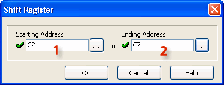
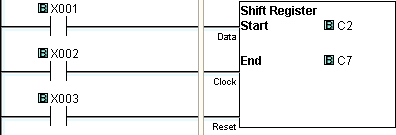
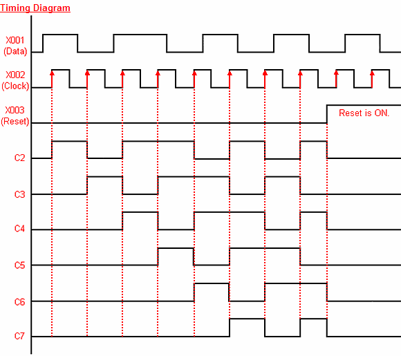

## Definition

The Shift Register instruction Shifts a range of control bits with each OFF-to-ON transition of the Clock pulse. If the Starting Address is lower than the Ending Address, the Shift register will Shift from the Starting Address to the Ending Address. If the Ending Address is lower than Starting Address then Shift Register will Shift from Ending Address to the Starting Address.

## Setup

1Starting Address: Identify the first ControlRelay in the ShiftRegister.

2 Ending Address: Identify the last ControlRelay in the ShiftRegister.

## Example Program

Example Program: Shift Right

In the following example, X001 represents the Data bit. When X001 is ON, C2 is ON. When X001 is OFF, C2 is OFF. X002 represents the Clock bit. Each time X002 transitions from OFF-to-ON, the current value (OFF or ON) in bits C2 through C7 shifts to the right by one memory location. X003 represents the Reset bit. When X003 is ON all bits in the ShiftRegister (C2 through C7 in the example) are turned OFF.

