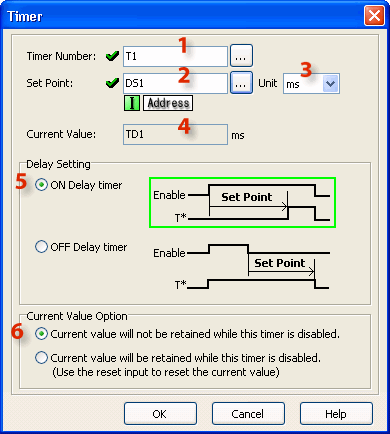
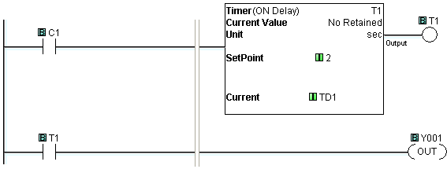
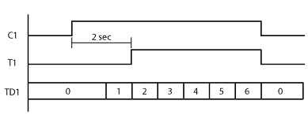
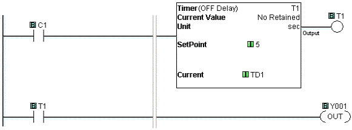
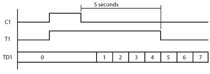
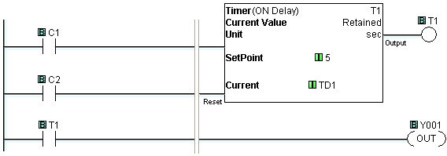

## Definition

An ON DelayTimer measures the time duration that begins with a transition of the enable rung from OFF to ON. Beyond this transition point, the Timer increases the Current Value, when it reaches the Set Point, the Timer Bit is turned ON.

An OFF DelayTimer measures the time duration that begins with a transition of the enable rung from ON to OFF. Beyond this transition point, the Timer increases the Current Value, when it reaches the Set Point, the Timer Bit is turned OFF.

- **Warning:** After the Off-Delay Counter has been finished, if the Setpoint value is then changed to a value which is GREATER than the Current time value, then the output of the timer will come on again until the new, higher Setpoint value is reached.

## Setup

1 Timer Number: Assign Timer Number. Timer Numbers are assigned from the [Bit Memory Address](memory_addresses.md) range.

2 Set Point: Assign Data Memory Address to hold the Set Point value or a Constant. DS is the only eligible [Data Memory Address](memory_addresses.md) range.

3 Unit: Assign the time measurement Units using the [Drop Down List](popup_timer_units_dropdwn.md) (ms, sec, min, hour, day).

4 Current Value: When the Timer Number is assigned (see 1 above), the Current Value is automatically assigned to the corresponding Timer Data register. T1 corresponds to TD1, T2 corresponds to TD2, etc.

5 Delay Setting: The Timer can be set up as an ON Delay Timer or an OFF Delay Timer. Use the radio buttons to make the selection.

6 Current Value Option: The Current Value either resets automatically when the Timer is disabled or it requires a Reset. Make the selection using the radio buttons. If you select Reset, an additional rung connection will appear in the Ladder Editor. Use the Line tool to connect the Reset connection to the left rail and add enabling contacts as necessary. This Option is available only for the ON Delay Timer mode.

## Example Programs

Example Program 1: ON Delay Timer

In the following example, timer status bit memory T1 is turned ON two seconds after C1 is turned ON. Then the second rung turns Y001 ON.

Timing Diagram

Example Program 2: OFF Delay Timer

In the following example, timer status bit memory T1 is turned ON immediately after C1 is turned ON. Then T1 stays on 5 seconds after C1 is turned OFF. While T1 is ON, the second rung keeps Y001 ON.

Timing Diagram

Example Program 3: Retained Current Value

In the following example, it is not necessary to keep C1 ON for five seconds continuously to turn timer status bit memory T1 ON. Instead, C1 needs to be ON for five seconds in total. While T1 is ON, the second rung keeps Y001 ON. When C2 is ON, the timer is Reset.

Timing Diagram

### Related Topics:

[Memory Addresses](memory_addresses.md)
