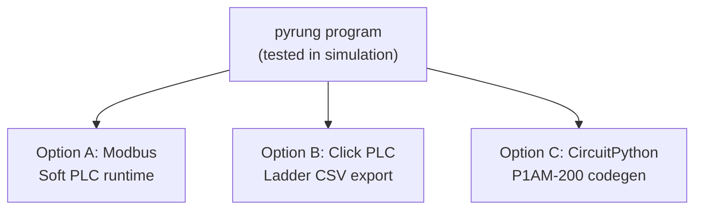

# Lesson 11: From Simulation to Hardware

The lessons are done. You've built a conveyor sorting station with start/stop/e-stop, a state-driven sorting sequence, auto and manual modes, structured bin counting, and a test suite that proves it all works. Everything from here is about taking what you've built and connecting it to the physical world.



## Option A: Connect via Modbus

Run your sorting station behind a Modbus TCP interface. HMIs, SCADA systems, [ClickNick](https://github.com/ssweber/clicknick)'s Dataview window, or other PLCs can connect to your running pyrung program and read or write tags as if it were a Click PLC. An operator can watch box counts climb, toggle between auto and manual, and press E-stop -- all from a real HMI talking to your simulated conveyor.

## Option B: Map to a Click PLC

```python
from pyrung.click import x, y, ds, TagMap, pyrung_to_ladder

mapping = TagMap({
    Start:          x[1],       # Physical input terminal 1
    Stop:           x[2],
    Estop:          x[3],
    Auto:           x[4],
    Manual:         x[5],
    EntrySensor:    x[6],
    DiverterBtn:    x[7],
    Bin[1].sensor:  x[8],
    Bin[2].sensor:  x[9],
    ConveyorMotor:  y[1],       # Physical output terminal 1
    DiverterCmd:    y[2],
    Light:          y[3],
})

mapping.validate(logic)                       # Check against Click constraints
pyrung_to_ladder(logic, mapping, "conveyor/")  # Export ladder CSV + nicknames
```

The validator will tell you exactly what your program does that a Click PLC can't handle. For example, pyrung lets you write `Rung(SizeReading + Offset > Threshold)` with math directly in the condition, but Click requires you to `calc` that into a separate tag first. The validator catches this and tells you what to fix.

Once it's clean, `pyrung_to_ladder` generates the ladder CSV files and nickname mappings. From there, [ClickNick](https://github.com/ssweber/clicknick)'s Guided Paste walks you through importing the ladder into Click, file by file, with the confidence that it's already been tested.

For a full reference on memory banks, address mapping, and `named_array` patterns for Click, see the [Click Cheatsheet](../guides/click-cheatsheet.md).

## Option C: Generate CircuitPython for a P1AM-200

```python
from pyrung.circuitpy import P1AM, generate_circuitpy

hw = P1AM()
inputs  = hw.slot(1, "P1-08SIM")   # 8-ch discrete input
outputs = hw.slot(2, "P1-08TRS")   # 8-ch discrete output

source = generate_circuitpy(logic, hw, target_scan_ms=10.0)
```

This produces a self-contained CircuitPython file with a `while True` scan loop that runs the same sorting logic directly on a P1AM-200 microcontroller with Productivity1000 I/O modules. Copy it to the board and it runs. Same logic, same behavior, real hardware.

---

## Where to go from here

You started with a button that turned on a motor. You ended with a tested, deployable conveyor sorting station -- start/stop/e-stop, auto and manual modes, a state machine that reads box sizes, positions a diverter, counts into bins, and logs the last five sorts. Every concept along the way was motivated by something the conveyor needed.

For deeper topics, the pyrung docs cover:

- [Data movement](../instructions/copy.md): `copy`, `blockcopy`, `fill`, type conversion
- [Math](../instructions/math.md): `calc()`, overflow behavior, range sums
- [Tag structures](../guides/tag-structures.md): named arrays, cloning, field defaults, hardware mapping
- [Drum sequencers, shift registers, search](../instructions/drum-shift-search.md): advanced pattern instructions
- [Subroutines and program control](../instructions/program-control.md): `call`, `forloop`, multi-program structure
- [Communication](../instructions/communication.md): Modbus `send`/`receive`
- [VS Code debugger](../guides/dap-vscode.md): step through scans, set breakpoints on rungs, watch tags live
- [Click PLC dialect](../dialects/click.md): full hardware mapping and validation
- [CircuitPython deployment](../dialects/circuitpy.md): generate code for P1AM-200

---

*Built with [pyrung](https://github.com/ssweber/pyrung). Write ladder logic in Python, simulate it, test it, deploy it.*
