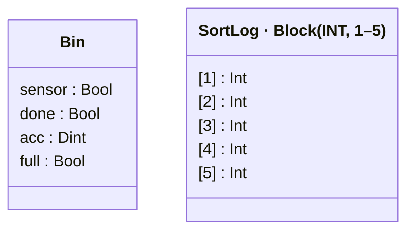

# Lesson 9: Structured Tags and Blocks

## The Python instinct

```python
@dataclass
class Bin:
    sensor: bool = False
    count: int = 0
    full: bool = False

bins = [Bin(), Bin()]
size_log = [0] * 5
```

Python has dataclasses for structured records and lists for arrays. Ladder logic has both too, but they map to fixed regions of PLC memory.

## UDTs

Up to now, each bin had its own separate tags: `BinASensor`, `BinAAcc`, `BinBSensor`, `BinBAcc`. That's fine for two bins, but it doesn't scale -- and it doesn't match how real plants are organized. Identical equipment should use identical structures.

```python
from pyrung import udt, Bool, Int, Dint, Program, Rung, PLCRunner, out, rise, count_up

@udt(count=2)
class Bin:
    sensor: Bool
    done: Bool
    acc: Dint
    full: Bool

CountReset = Bool("CountReset")

with Program() as logic:
    with Rung(rise(Bin[1].sensor)):
        count_up(Bin[1].done, Bin[1].acc, preset=10) \
            .reset(CountReset)
    with Rung(rise(Bin[2].sensor)):
        count_up(Bin[2].done, Bin[2].acc, preset=10) \
            .reset(CountReset)

    with Rung(Bin[1].done):
        out(Bin[1].full)
    with Rung(Bin[2].done):
        out(Bin[2].full)
```

`@udt(count=2)` creates two instances, accessed by index. `Bin[1].sensor` and `Bin[2].sensor` are distinct tags, but they share the same structure. This maps directly to how real plants are organized: identical equipment, replicated logic, consistent naming.



When all fields share the same type (like a group of Int fields for one sensor), pyrung also offers `named_array`, which maps to contiguous memory and supports bulk operations. See the [Tag Structures guide](../guides/tag-structures.md) for details.

## Blocks

When you need an array of same-typed tags rather than a structured record, a `Block` gives you a contiguous range you can index into and operate on in bulk. Here's a sort log that records the last 5 box sizes:

```python
from pyrung import Block, TagType, copy, blockcopy

SortLog  = Block("SortLog", TagType.INT, 1, 5)    # SortLog1..SortLog5
BoxSize  = Int("BoxSize")
NewBox   = Bool("NewBox")

with Program() as logic:
    # (bin counting rungs from above...)

    # Log box sizes: shift register pattern
    with Rung(rise(NewBox)):
        blockcopy(SortLog.select(1, 4), SortLog.select(2, 5))  # Shift down
        copy(BoxSize, SortLog[1])                                # Insert at front
```

`SortLog.select(1, 4)` gives you SortLog1 through SortLog4 as a range, and `blockcopy` moves the whole thing in one instruction. The oldest value in SortLog5 falls off the end. This is the ladder equivalent of `log.insert(0, new_value)`: no loops, no index arithmetic.

## Try it

```python
runner = PLCRunner(logic)
with runner.active():
    # 3 boxes into Bin 1
    for _ in range(3):
        Bin[1].sensor.value = True
        runner.step()
        Bin[1].sensor.value = False
        runner.step()

    assert Bin[1].acc.value == 3
    assert Bin[2].acc.value == 0    # Bin 2 untouched
    assert Bin[1].full.value is False

    # Log 3 box sizes
    for size in [150, 80, 200]:
        BoxSize.value = size
        NewBox.value = True
        runner.step()
        NewBox.value = False
        runner.step()

    # Newest first
    assert SortLog[1].value == 200
    assert SortLog[2].value == 80
    assert SortLog[3].value == 150
```

!!! info "Also known as..."

    Structured tags are UDTs or `STRUCT`s on higher-end PLCs. Flat-namespace PLCs fake it with underscore prefixes — exactly what pyrung generates as the flat identity. Block-copy, shift-register, and fill all have dedicated instructions — `COP`/`COPY`, `BSL`/`BSR`/`SHIFT`, `FAL`/`FILL`.

## Exercise

Add a singleton `Conveyor` UDT with fields for `running` (Bool), `speed` (Int), and `motorFault` (Bool). Write logic where the conveyor stops when `motorFault` is true, regardless of the running state. Use `fill` to add a "clear log" function: when a `ClearLog` button is pressed, fill the SortLog with zeros. (Hint: see the [Data Movement reference](../instructions/copy.md) for `fill`.)

---

The logic is complete. Now prove it works -- write a test suite that covers the normal cycle, the fault path, the mode switch, and the edge cases.
