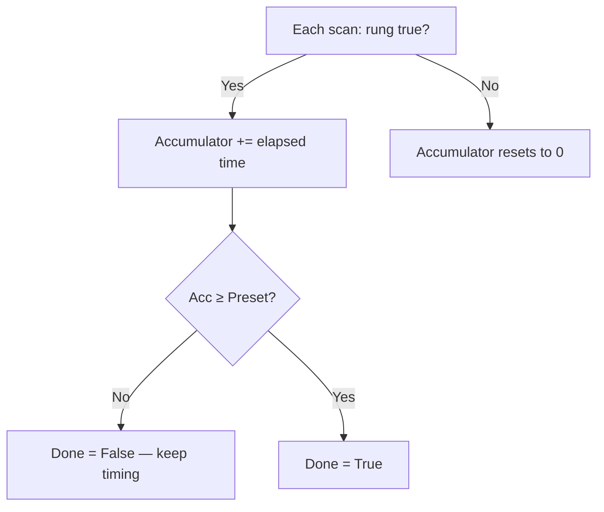

# Lesson 5: Timers

## The Python instinct

```python
import time
diverter_open = True
time.sleep(2)  # Block for 2 seconds while the box passes
diverter_open = False
```

## Why that's wrong here

A PLC can't sleep. It has to keep scanning because sensors are still reading, safety interlocks are still being checked, and other rungs still need to execute. Blocking is not an option when you're controlling physical equipment.

## The ladder logic way

Timers **accumulate** across scans: every scan where the rung is true, the timer adds a little more time, and when the accumulator reaches the preset, it fires.



The diverter gate needs to stay open for 2 seconds while a box passes through. Here's how:

```python
from pyrung import Bool, Int, Program, Rung, PLCRunner, TimeMode, Tms, on_delay, out

EntrySensor = Bool("EntrySensor")
DiverterCmd = Bool("DiverterCmd")
HoldDone    = Bool("HoldDone")
HoldAcc     = Int("HoldAcc")

with Program() as logic:
    with Rung(EntrySensor):
        on_delay(HoldDone, HoldAcc, preset=2000, unit=Tms)  # 2 seconds
    with Rung(EntrySensor, ~HoldDone):
        out(DiverterCmd)         # Hold diverter open while timing
```

This reads: "While the entry sensor sees a box, accumulate time. While the sensor is active and the timer hasn't finished, keep the diverter open." After 2 seconds, `HoldDone` goes true, `~HoldDone` goes false, and the diverter closes. If the sensor goes false early, the timer resets (that's `on_delay` / TON behavior).

## Test it deterministically

```python
runner = PLCRunner(logic)
runner.set_time_mode(TimeMode.FIXED_STEP, dt=0.010)  # 10 ms per scan

with runner.active():
    EntrySensor.value = True

runner.run(cycles=199)                        # 1.99 seconds
with runner.active():
    assert DiverterCmd.value is True          # Diverter still held open

runner.step()                                 # 2.00 seconds
with runner.active():
    assert DiverterCmd.value is False         # Released -- box has passed
```

`FIXED_STEP` mode advances the clock by exactly 10 ms each scan. No wall clock. Perfectly deterministic. This is why pyrung exists. Try writing this test against real hardware.

!!! info "Also known as..."

    On-delay is `TON` or `TMR`; off-delay is `TOF`; retentive on-delay is `RTO` or `TMRA`. The done bit is `.DN`, `.Done`, or `.Q`; the accumulator is `.ACC`, `.Acc`, or `.ET`. pyrung makes these explicit tags so you can inspect and test them.

## Exercise

Build a startup delay: after pressing Start, the conveyor waits 3 seconds before the motor turns on (safety: gives workers time to clear the area). Test both paths: the full 3-second wait, and releasing Start early (timer resets, motor never starts).

---

The diverter holds long enough for one box. But how many boxes have gone to each bin? We need to count sensor edges without looping.
